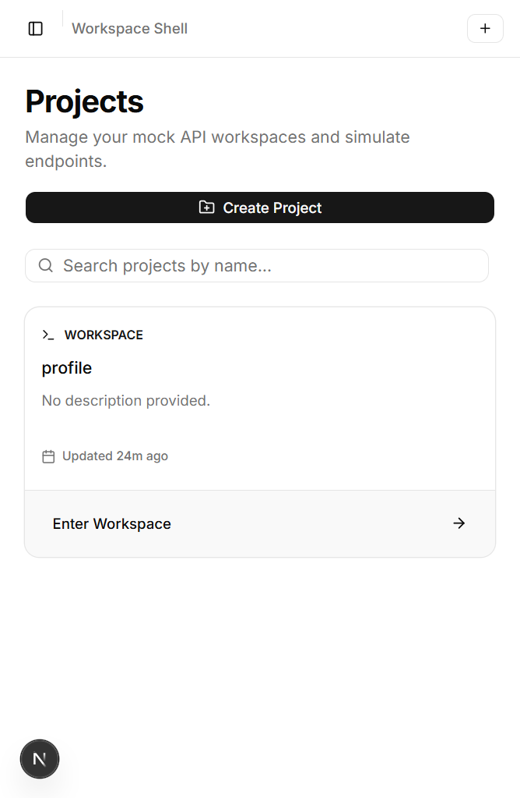
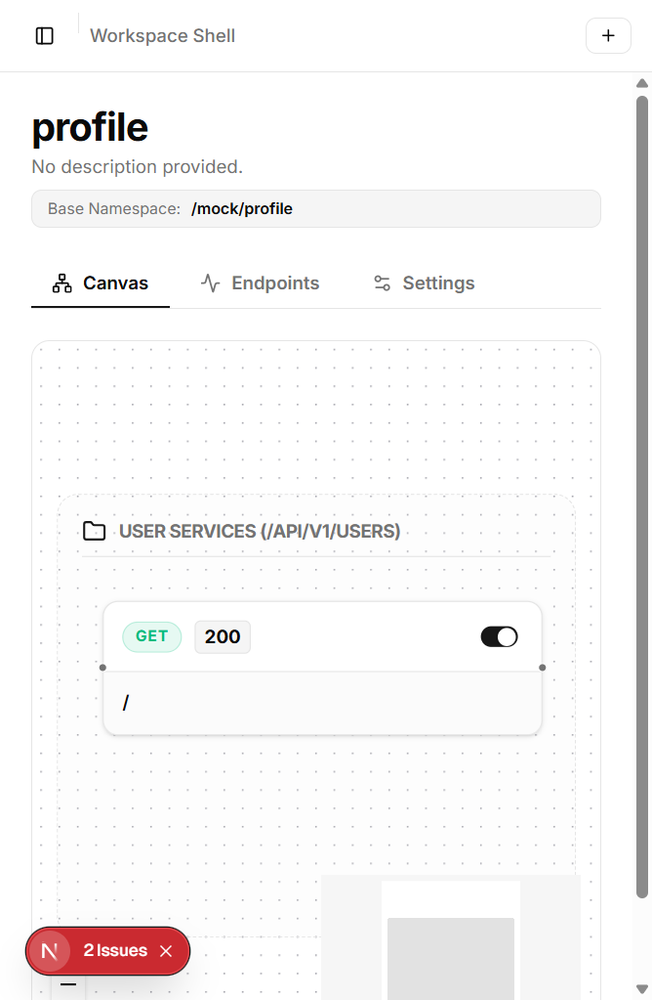
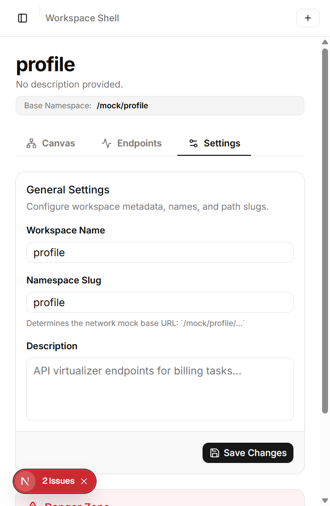

<p align="center">
  
</p>

# 🛠️ Fack API's — Open-Source Node-Based Mock API Platform

Fack API's is a self-hostable, zero-configuration mock API platform designed for modern frontend and backend decoupled workflows. It serves as a drop-in replacement for actual backend systems, enabling engineering teams to build projects, design routes graphically on a node canvas, synthesize deeply nested payload structures via visual schema builders, simulate network latency or errors, and generate client-side TypeScript definitions dynamically.

---

## 📸 Screenshots

To help you visualize the platform's power, here are actual screenshots of the Fack API's dashboard and editor:

### 1. 🗂️ Workspaces Dashboard
Manage all your isolated project workspaces, filter namespaces, and create projects.


### 2. 🎨 Node-Based Canvas Designer
Graphically orchestrate endpoint groups, HTTP methods, status codes, and active states.


### 3. ⚙️ Workspace Settings & Safe Deletion
Configure paths, namespaces, and manage safe workspace deletions using type-to-confirm validation.


---

## ✨ Features

- **🌐 Isolated Projects**: Multitenancy-ready isolation of routes under custom URL namespaces.
- **🎨 Visual Node Canvas**: Drag-and-drop orchestration of endpoints and routes powered by React Flow.
- **🌳 Deeply Nested JSON Schema Builder**: Visual tree builder supporting infinite nesting depth ("objects of objects") with type validation.
- **🎲 Rich Synthetic Data**: Fully integrated with Faker.js to output contextually accurate, randomized data (names, locations, finance, identifiers, etc.).
- **⚡ Chaos Simulation Module**: Custom latency range configuration (min/max delays) and probabilistic status code failures to test client robustness.
- **📁 TypeScript Interface compiler**: Automatically converts visual response schemas to downloadable `.d.ts` TypeScript definitions.
- **🚀 Ultra-Portable Storage**: Backed by a single-file SQLite database with lightning-fast query response times under Drizzle ORM.
- **🐳 Docker Native**: Streamlined multi-stage Alpine Docker container configured for zero-friction hosting and volume persistence.

---

## 🏗️ Architecture

```
                 ┌────────────────────────────────┐
                 │       Dashboard UI (Client)    │
                 └──────────────┬─────────────────┘
                                │
                    (JSON Schemas & Topology)
                                │
                                ▼
                 ┌────────────────────────────────┐
                 │       SQLite DB (Drizzle)      │
                 └──────────────┬─────────────────┘
                                │
                         (Load schemas)
                                │
                                ▼
  Request  ─────►┌────────────────────────────────┐
 (/mock/*)       │       Proxy Layer (Router)     │
                 └──────────────┬─────────────────┘
                                │
                       (path-to-regexp Match)
                                │
                                ▼
                 ┌────────────────────────────────┐
                 │   Mock Engine (JSF + Faker.js) │
                 └────────────────────────────────┘
```

---

## 🛠️ Technology Stack

| Component | Technology | Role |
| :--- | :--- | :--- |
| **Framework** | Next.js 16 (App Router) | Control & Data Plane runtime |
| **Flow Editor** | React Flow | Node-based route orchestration |
| **UI Components** | shadcn/ui (Radix UI + Tailwind CSS v4) | Interactive dashboard interface |
| **State Manager** | Zustand + Immer | Deeply nested state modifications |
| **ORM** | Drizzle ORM | High-performance type-safe SQLite query layer |
| **Database** | SQLite & LibSQL (@libsql/client) | Portable file & Cloud distributed SQLite (Turso) |
| **Data Synthesizer**| json-schema-faker + Faker.js | Declarative mock payload generation |
| **Matcher** | path-to-regexp | Express-like route pattern matching |
| **Type Generator** | json-schema-to-typescript | Programmatic `.d.ts` compilation |

---

## 🚀 Quick Start (Local Development)

### Prerequisites
- Node.js 20+
- pnpm (v10+)

### Setup
1. Clone this repository
2. Install dependencies:
   ```bash
   pnpm install
   ```
3. Set up the local SQLite database directory and run migrations:
   ```bash
   mkdir data
   pnpm drizzle-kit push
   ```
4. Start the development server:
   ```bash
   pnpm dev
   ```
5. Open [http://localhost:3000](http://localhost:3000) in your browser, then navigate to `/dashboard` to manage workspaces.

---

## 🐳 Docker Deployment

To self-host Fack API's on your own server or private network:

1. Start the container with Docker Compose:
   ```bash
   docker compose up -d
   ```
2. The dashboard will be accessible at `http://localhost:3000`. All database data will persist inside the `fack-data` Docker volume.

---

## 📡 API Usage Example

Once you have configured a project with a slug `my-project` and added a route `GET /users/:userId` under an endpoint with basePath `/api/v1`, you can query the mock endpoint directly:

```bash
curl -X GET http://localhost:3000/mock/my-project/api/v1/users/42
```

### Response Payload:
```json
{
  "id": "42",
  "name": "Jane Smith",
  "email": "jane.smith@example.com",
  "profile": {
    "avatar": "https://avatars.io/jane_smith",
    "jobTitle": "Lead System Architect"
  }
}
```

---

## 📄 License

This project is licensed under the MIT License - see the LICENSE file for details.
