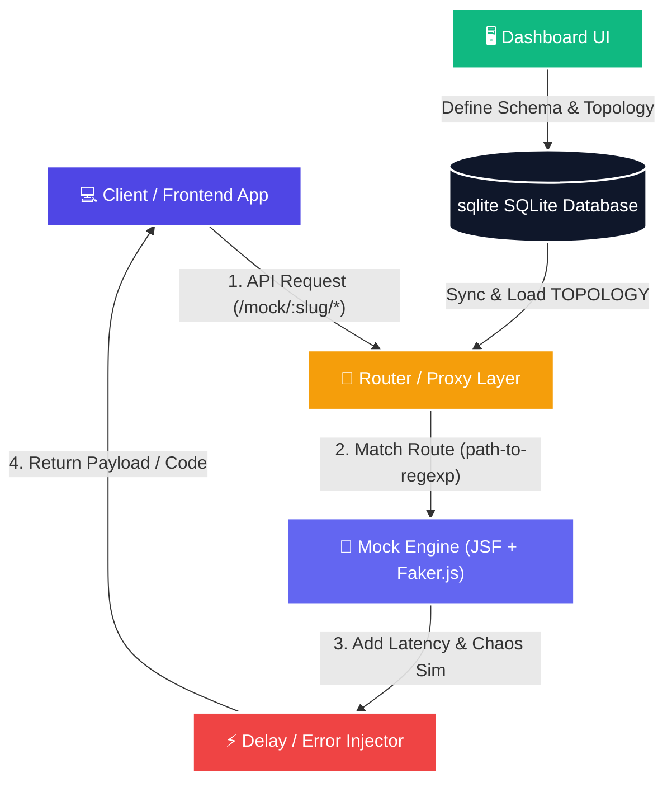

<p align="center">
  
</p>

<h1 align="center">🛠️ Fack API's</h1>

<p align="center">
  <strong>A premium, self-hostable, node-based mock API platform for modern frontend & backend decoupled workflows.</strong>
</p>

<p align="center">
  <a href="https://nextjs.org"></a>
  <a href="https://www.typescriptlang.org"></a>
  <a href="https://tailwindcss.com"></a>
  <a href="https://orm.drizzle.team"></a>
  <a href="https://sqlite.org"></a>
  <a href="https://docker.com"></a>
  <a href="./LICENSE"></a>
</p>

---

Fack API's is a zero-configuration, self-hostable mock API platform designed to streamline decoupled software development. It functions as a flexible, high-fidelity mock backend that allows frontend and mobile teams to build and test code independently. With a graphical node canvas, a visual schema builder, custom chaos testing, and automatic TypeScript compilation, Fack API's accelerates your dev cycle from days to hours.

---

## 📸 Screenshots & Showcase

<table>
  <tr>
    <td width="50%" align="center">
      <strong>🗂️ Workspaces Dashboard</strong><br />
      
    </td>
    <td width="50%" align="center">
      <strong>🎨 Node-Based Canvas Designer</strong><br />
      
    </td>
  </tr>
  <tr>
    <td colspan="2" align="center">
      <strong>⚙️ Workspace Settings & Safe Deletion</strong><br />
      
    </td>
  </tr>
</table>

---

## ✨ Features

- 🌐 **Isolated Namespaces**: Segment routes under individual projects and custom URL prefixes (e.g. `/mock/project-slug/...`).
- 🎨 **Visual Node Canvas**: Design your endpoints graphically, customize HTTP methods, and simulate response pipelines with **React Flow**.
- 🌳 **Nested JSON Schema Builder**: Build complex response bodies with deep nestings ("objects inside arrays of objects") without writing raw JSON.
- 🎲 **Faker.js Data Synthesizer**: Connect any schema property to a rich library of data providers (names, images, finance, strings, addresses).
- ⚡ **Chaos Testing Simulator**: Inject randomized delays (min/max latency) and specify failure rates (e.g. 5% of queries fail with a 500 error) to test UI resilience.
- 📁 **Type Contract Exporter**: Automatically compile client-side TypeScript interfaces (`.d.ts` files) directly from your visual schemas.
- 🚀 **Zero-Config Database**: Backed by a high-performance local SQLite file wrapped in type-safe Drizzle ORM queries.
- 🐳 **Native Containerization**: Light Alpine-based multi-stage Docker build ready for instant deployments with persistent volumes.

---

## 🏗️ Architecture



---

## 🛠️ Technology Stack

| Component | Technology | Role |
| :--- | :--- | :--- |
| **Framework** | Next.js 16 (App Router) | Runtime container, rendering, and API handler |
| **Flow Canvas** | React Flow (v12) | Topology graph canvas layout |
| **UI Components** | Radix UI + Tailwind CSS v4 | Clean interface styling and accessibility |
| **State Manager** | Zustand + Immer | Schema tree edits and node transformations |
| **ORM** | Drizzle ORM | Database schema mapping and DDL generation |
| **Database** | SQLite (@libsql/client) | Portable file-based storage engine |
| **Mock Engine** | json-schema-faker + Faker.js | Synthetic mock payload parser |
| **Route Matcher** | path-to-regexp | Fast Express-like matching |
| **Type Compiler** | json-schema-to-typescript | Compiles schema trees into raw `.d.ts` strings |

---

## 🚀 Quick Start (Local Development)

### Prerequisites
- Node.js 20+
- pnpm (v10+)

### Step-by-Step Setup
1. **Clone the repository** and enter the folder.
2. **Install dependencies**:
   ```bash
   pnpm install
   ```
3. **Initialize the local database**:
   ```bash
   mkdir data
   pnpm drizzle-kit push
   ```
4. **Boot the Next.js server**:
   ```bash
   pnpm dev
   ```
5. Open [http://localhost:3000/dashboard](http://localhost:3000/dashboard) to manage your projects.

---

## 🐳 Docker Deployment

To self-host Fack API's on your local network or server, you have two options:

### Option A: Pull Pre-built Image from Docker Hub
You can pull and run the official pre-built image directly:

```bash
# Pull the Docker image
docker pull mkkatiyar277/fake-api:latest

# Run the container
docker run -d -p 3000:3000 -v fack-data:/app/data mkkatiyar277/fake-api:latest
```

*Note: Replace `latest` with a specific version tag if needed.*

### Option B: Build and Run with Docker Compose
If you cloned the source repository and want to run it locally using Docker Compose:

1. **Spin up the container**:
   ```bash
   docker compose up -d
   ```

2. The dashboard will be accessible at `http://localhost:3000`. 
3. Database and project topologies are persisted in the `fack-data` volume.

---

## 📡 API Usage Example

If you create a project `payment-service` and add a `GET /v1/customers/:customerId` route:

```bash
curl -X GET http://localhost:3000/mock/payment-service/v1/customers/cust_9923
```

### Response Payload:
```json
{
  "id": "cust_9923",
  "name": "Jane Smith",
  "email": "jane.smith@example.com",
  "profile": {
    "avatar": "https://avatars.io/jane_smith",
    "jobTitle": "Lead System Architect"
  }
}
```

---

## 📄 License

This project is licensed under the MIT License - see the [LICENSE](file:///e:/fack-api/LICENSE) file for details.
