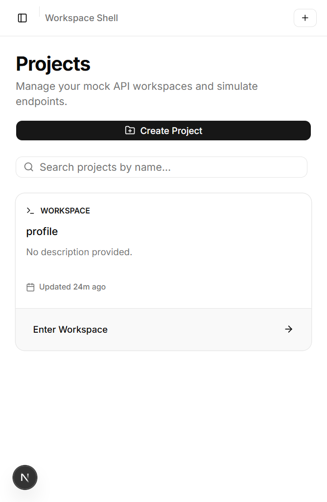
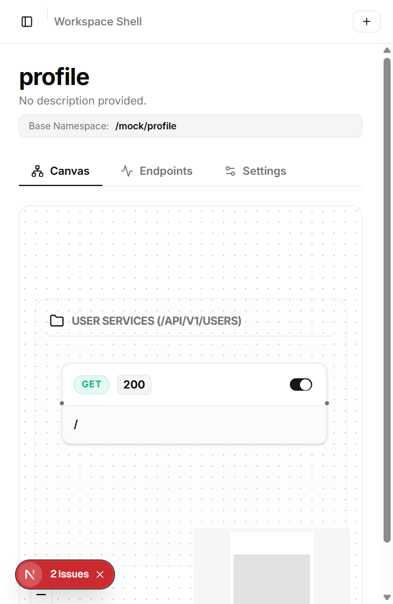
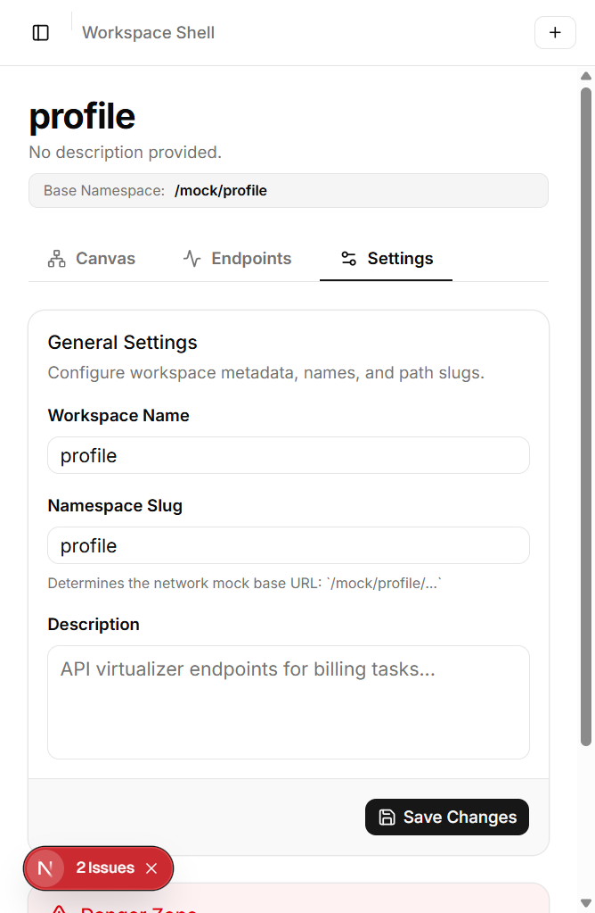
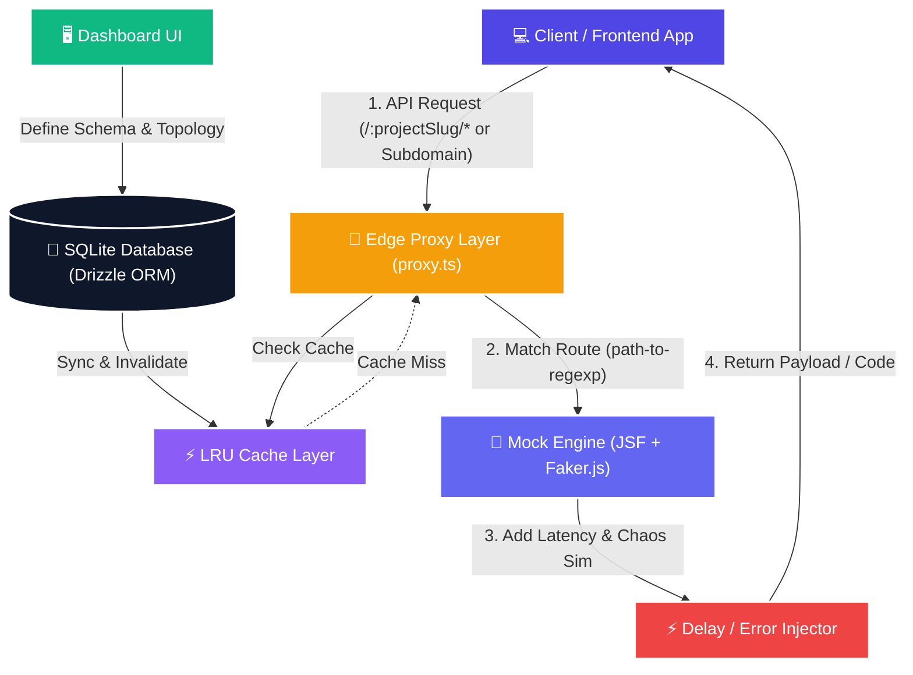

<p align="center">
  
</p>

<h1 align="center">🛠️ FACK API'S</h1>

<p align="center">
  <strong>A premium, self-hostable, node-based mock API platform for modern frontend & backend decoupled workflows.</strong>
</p>

<p align="center">
  <a href="https://nextjs.org"></a>
  <a href="https://react.dev"></a>
  <a href="https://www.typescriptlang.org"></a>
  <a href="https://tailwindcss.com"></a>
  <a href="https://orm.drizzle.team"></a>
  <a href="https://sqlite.org"></a>
  <a href="https://docker.com"></a>
  <a href="./LICENSE"></a>
</p>

---

Fack API's is a zero-configuration, self-hostable mock API platform designed to streamline decoupled software development. It functions as a flexible, high-fidelity mock backend that allows frontend and mobile teams to build and test code independently. With a graphical node canvas, a visual schema builder, custom chaos testing, and automatic TypeScript compilation, Fack API's accelerates your dev cycle from days to hours.

---

## 📸 Screenshots & Showcase

<table>
  <tr>
    <td width="50%" align="center">
      <strong>🗂️ Workspaces Dashboard</strong><br />
      
    </td>
    <td width="50%" align="center">
      <strong>🎨 Node-Based Canvas Designer</strong><br />
      
    </td>
  </tr>
  <tr>
    <td colspan="2" align="center">
      <strong>⚙️ Workspace Settings & Safe Deletion</strong><br />
      
    </td>
  </tr>
</table>

---

## ✨ Features

- 🌐 **Clean Namespaces & Subdomain Routing**: Direct endpoint access without unnecessary prefixes (e.g., `http://localhost:3000/:projectSlug/...` or subdomain `http://:projectSlug.localhost:3000/...`).
- 🎨 **Visual Node Canvas**: Design your endpoints graphically, customize HTTP methods, and simulate response pipelines with **React Flow** (@xyflow/react).
- 🌳 **Nested JSON Schema Builder**: Build complex response bodies with deep nestings (objects, arrays, primitives) without writing manual JSON schemas.
- 🎲 **Faker.js Data Synthesizer**: Connect any schema property to a rich library of data providers (names, images, finance, dates, addresses, internet).
- ⚡ **Chaos Testing Simulator**: Inject randomized delays (min/max latency) and specify failure rates (e.g., 5% of queries fail with a 500 error) to test UI resilience.
- ⚡ **Bounded LRU Cache Layer**: In-memory caching with configurable TTL and granular per-project and per-route cache invalidation.
- 📁 **Type Contract Exporter**: Automatically compile client-side TypeScript interfaces (`.d.ts` files) directly from your visual schemas.
- 📐 **Agent-First Design System Linting**: Validated with `@shadcn/lint` and ESLint 9 to ensure strict design system compliance.
- 🚀 **Zero-Config Database**: Backed by high-performance local SQLite wrapped in type-safe Drizzle ORM queries.
- 🐳 **Native Containerization**: Multi-stage Alpine Docker build with Docker Compose support for persistent storage and logging.

---

## 🏗️ Architecture


```mermaid
graph TD
    A["💻 Client / Frontend App"] -->|"1. API Request (/:projectSlug/* or Subdomain)"| D["🔀 Edge Proxy Layer (proxy.ts)"]
    B["🖥️ Dashboard UI"] -->|"Define Schema & Topology"| C[("💾 SQLite Database (Drizzle ORM)")]
    C -->|"Sync & Invalidate"| CACHE["⚡ LRU Cache Layer"]
    D -->|"Check Cache"| CACHE
    CACHE -.->|"Cache Miss"| D
    D -->|"2. Match Route (path-to-regexp)"| E["🎲 Mock Engine (JSF + Faker.js)"]
    E -->|"3. Add Latency & Chaos Sim"| F["⚡ Delay / Error Injector"]
    F -->|"4. Return Payload / Code"| A

    style A fill:#4F46E5,stroke:#fff,stroke-width:2px,color:#fff
    style B fill:#10B981,stroke:#fff,stroke-width:2px,color:#fff
    style C fill:#0F172A,stroke:#fff,stroke-width:2px,color:#fff
    style D fill:#F59E0B,stroke:#fff,stroke-width:2px,color:#fff
    style E fill:#6366F1,stroke:#fff,stroke-width:2px,color:#fff
    style F fill:#EF4444,stroke:#fff,stroke-width:2px,color:#fff
    style CACHE fill:#8B5CF6,stroke:#fff,stroke-width:2px,color:#fff
```

---

## 🛠️ Technology Stack

| Component         | Technology                           | Role                                           |
| :---------------- | :----------------------------------- | :--------------------------------------------- |
| **Framework**     | Next.js 16 (App Router + Turbopack)  | Runtime container, SSR, and edge proxy handler |
| **UI Library**    | React 19                             | Modern reactive component foundation           |
| **Flow Canvas**   | React Flow (@xyflow/react v12)       | Visual node topology canvas                    |
| **UI Primitives** | Base UI (@base-ui/react) + shadcn/ui | Accessible headless and styled UI components   |
| **Styling**       | Tailwind CSS v4                      | High-performance utility styling               |
| **State Manager** | Zustand v5 + Immer                   | Reactive schema editing and state persistence  |
| **ORM**           | Drizzle ORM (v0.45)                  | Database schema mapping and DDL generation     |
| **Database**      | SQLite (@libsql/client)              | Fast, portable file-based database             |
| **Cache Layer**   | LRUCache (`lru-cache`)               | Bounded in-memory route and data cache         |
| **Mock Engine**   | json-schema-faker + @faker-js/faker  | Synthetic mock payload generation              |
| **Route Matcher** | path-to-regexp                       | Express-style pattern matching                 |
| **Type Compiler** | json-schema-to-typescript            | Compiles schema trees into TypeScript types    |
| **Code Quality**  | ESLint 9 + @shadcn/lint + Prettier   | Linting and design system enforcement          |
| **Test Runner**   | Vitest v4                            | Fast unit and integration testing              |

---

## 🚀 Quick Start (Local Development)

### Prerequisites

- **Node.js 20.19+** (Node.js 26 recommended)
- **pnpm** (v10+ or v11+)

### Step-by-Step Setup

1. **Clone the repository**:

   ```bash
   git clone https://github.com/Karelaking/fack-api.git
   cd fack-api
   ```

2. **Install dependencies**:

   ```bash
   pnpm install
   ```

3. **Initialize the local database**:

   ```bash
   pnpm drizzle-kit push
   ```

4. **Boot the Next.js development server**:

   ```bash
   pnpm dev
   ```

5. Open [http://localhost:3000](http://localhost:3000) for the landing page or [http://localhost:3000/dashboard](http://localhost:3000/dashboard) to manage your projects.

### Additional Scripts

- **Run tests**:
  ```bash
  pnpm test
  ```
- **Run linter**:
  ```bash
  pnpm lint
  ```
- **Build production bundle**:
  ```bash
  pnpm build
  ```

---

## 🐳 Docker Deployment

You can self-host Fack API's on your local machine, homelab, or cloud server:

### Option A: Build and Run with Docker Compose (Recommended)

Docker Compose sets up Fack API's alongside an optional PostgreSQL instance for request logging and Nginx for reverse proxying:

```bash
docker compose up -d
```

- Dashboard is accessible at `http://localhost:3000` (or `http://localhost:80` via Nginx).
- Database and project topologies are persisted in the `fack-data` Docker volume.

### Option B: Pull Pre-built Image from Docker Hub

```bash
# Pull the Docker image
docker pull mkkatiyar277/fake-api:latest

# Run the container with persistent volume
docker run -d -p 3000:3000 -v fack-data:/app/data mkkatiyar277/fake-api:latest
```

---

## 📡 API Usage Example

Create a project with slug `payment-service` and add a route `GET /v1/customers/:customerId`:

### Direct Path Routing:

```bash
curl -X GET http://localhost:3000/payment-service/v1/customers/cust_9923
```

### Subdomain Routing (Local or Production):

```bash
curl -X GET http://payment-service.localhost:3000/v1/customers/cust_9923
```

### Response Payload:

```json
{
  "id": "cust_9923",
  "name": "Jane Smith",
  "email": "jane.smith@example.com",
  "profile": {
    "avatar": "https://avatars.io/jane_smith",
    "jobTitle": "Lead System Architect"
  }
}
```

### Query Parameter Filtering & Pagination

The mock engine supports dynamic pagination and query parameters out of the box:

```bash
curl -X GET "http://localhost:3000/payment-service/v1/customers?count=5"
```

---

## 📄 License

This project is licensed under the MIT License - see the [LICENSE](./LICENSE) file for details.
