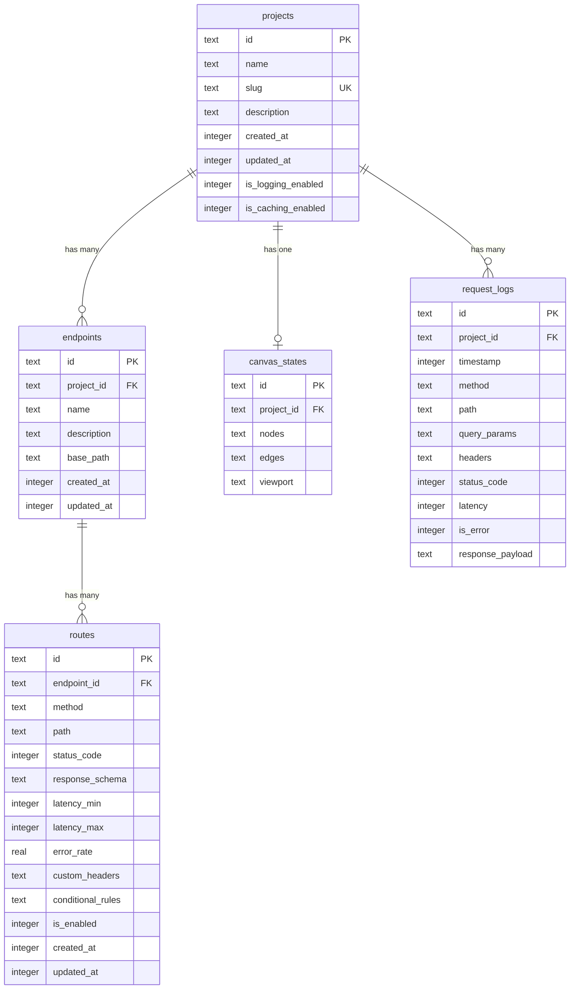

Fack API uses **Drizzle ORM** configured over **SQLite (libSQL)**. The relational model is designed for high read throughput, deterministic cascading deletes, and seamless deployment across local filesystem files and serverless cloud databases like Turso.

## Entity Relationships

The data model organizes resources hierarchically around projects. A single project workspace owns multiple endpoints, a dedicated canvas state for visual editing, and an append-only collection of request telemetry logs.



## Tables & Field Definitions

### `projects`

The top-level container for all endpoints, canvas layouts, and telemetry.

<TypeTable
  type={{
    id: {
      description: 'Primary key (UUID or CUID string).',
      type: 'text (PK)',
    },
    name: {
      description: 'Human-readable project display name.',
      type: 'text',
    },
    slug: {
      description: 'Unique URL slug used for path and subdomain routing (e.g. shop).',
      type: 'text (unique)',
    },
    description: {
      description: 'Optional Markdown summary of the project workspace.',
      type: 'text',
    },
    createdAt: {
      description: 'Timestamp when the project was created.',
      type: 'integer (timestamp)',
    },
    updatedAt: {
      description: 'Timestamp when project settings were last modified.',
      type: 'integer (timestamp)',
    },
    isLoggingEnabled: {
      description: 'Boolean flag toggling telemetry capture for mock calls (default: true).',
      type: 'integer (boolean)',
    },
    isCachingEnabled: {
      description: 'Boolean flag enabling in-memory LRU response caching (default: true).',
      type: 'integer (boolean)',
    },
  }}
/>

### `endpoints`

Logical groupings of routes sharing a common domain or base path (e.g., `/v1/users`).

<TypeTable
  type={{
    id: {
      description: 'Primary key identifier.',
      type: 'text (PK)',
    },
    projectId: {
      description: 'Foreign key referencing projects.id with cascading delete.',
      type: 'text (FK)',
    },
    name: {
      description: 'Descriptive title for the endpoint group.',
      type: 'text',
    },
    description: {
      description: 'Optional summary describing the endpoint group.',
      type: 'text',
    },
    basePath: {
      description: 'URL prefix prepended to all child routes (e.g. /api/v1).',
      type: 'text',
    },
    createdAt: {
      description: 'Timestamp when the endpoint group was created.',
      type: 'integer (timestamp)',
    },
    updatedAt: {
      description: 'Timestamp when the endpoint group was last updated.',
      type: 'integer (timestamp)',
    },
  }}
/>

### `routes`

Specific HTTP method and path combinations that evaluate schemas and serve responses.

<TypeTable
  type={{
    id: {
      description: 'Primary key identifier.',
      type: 'text (PK)',
    },
    endpointId: {
      description: 'Foreign key referencing endpoints.id with cascading delete.',
      type: 'text (FK)',
    },
    method: {
      description: 'Allowed HTTP verb: GET, POST, PUT, DELETE, or PATCH.',
      type: 'enum',
    },
    path: {
      description: 'Relative path with dynamic param tokens (e.g. /:userId).',
      type: 'text',
    },
    statusCode: {
      description: 'Default HTTP status code returned upon success (default: 200).',
      type: 'integer',
    },
    responseSchema: {
      description: 'Serialized JSON Schema document with x-faker bindings.',
      type: 'text (JSON)',
    },
    latencyMin: {
      description: 'Minimum simulated artificial latency jitter in milliseconds.',
      type: 'integer',
    },
    latencyMax: {
      description: 'Maximum simulated artificial latency jitter in milliseconds.',
      type: 'integer',
    },
    errorRate: {
      description: 'Probability (0.0 to 1.0) of triggering chaos failure responses.',
      type: 'real',
    },
    customHeaders: {
      description: 'Serialized key-value pairs of custom HTTP response headers.',
      type: 'text (JSON)',
    },
    conditionalRules: {
      description: 'Serialized array of conditional matching rules and response overrides.',
      type: 'text (JSON)',
    },
    isEnabled: {
      description: 'Flag to enable or temporarily disable the route from matching.',
      type: 'integer (boolean)',
    },
    createdAt: {
      description: 'Timestamp when the route was created.',
      type: 'integer (timestamp)',
    },
    updatedAt: {
      description: 'Timestamp when the route was last modified.',
      type: 'integer (timestamp)',
    },
  }}
/>

### `canvas_states`

Persists the React Flow visual canvas nodes, edge connections, and viewport coordinates for each project workspace.

<TypeTable
  type={{
    id: {
      description: 'Primary key identifier.',
      type: 'text (PK)',
    },
    projectId: {
      description: 'Foreign key referencing projects.id (1-to-1 unique relationship).',
      type: 'text (FK unique)',
    },
    nodes: {
      description: 'Serialized React Flow node hierarchy and positions.',
      type: 'text (JSON)',
    },
    edges: {
      description: 'Serialized visual connector lines between canvas cards.',
      type: 'text (JSON)',
    },
    viewport: {
      description: 'Serialized pan and zoom transform ({ x, y, zoom }).',
      type: 'text (JSON)',
    },
  }}
/>

### `request_logs`

Captures telemetry for requests processed by the mock engine.

<TypeTable
  type={{
    id: {
      description: 'Primary key identifier.',
      type: 'text (PK)',
    },
    project_id: {
      description: 'Foreign key referencing projects.id with cascading delete.',
      type: 'text (FK)',
    },
    timestamp: {
      description: 'Millisecond Unix timestamp of the request execution.',
      type: 'integer',
    },
    method: {
      description: 'Inbound HTTP verb.',
      type: 'text',
    },
    path: {
      description: 'Concrete requested URL path.',
      type: 'text',
    },
    query_params: {
      description: 'Captured URL query parameters serialized as JSON.',
      type: 'text (JSON)',
    },
    headers: {
      description: 'Inbound request headers serialized as JSON.',
      type: 'text (JSON)',
    },
    status_code: {
      description: 'Numeric HTTP status code emitted to client.',
      type: 'integer',
    },
    latency: {
      description: 'Execution duration in milliseconds.',
      type: 'integer',
    },
    is_error: {
      description: 'Boolean flag indicating if the call resulted in a 4xx/5xx status.',
      type: 'integer',
    },
    response_payload: {
      description: 'Synthesized JSON response payload emitted to client.',
      type: 'text (JSON)',
    },
  }}
/>

## Cascading Deletes & Integrity

Foreign keys in Fack API are defined with `onDelete: "cascade"`. When a project is deleted:

- All child **endpoints** are automatically deleted.
- All child **routes** attached to those endpoints are deleted.
- The project's **canvas state** is pruned.
- All associated **request logs** are permanently purged from the database.

This guarantees zero orphan rows and maintains strict referential integrity without manual cleanup scripts.

## Drizzle CLI Commands

Fack API includes Drizzle Kit scripts in `package.json` for managing schema migrations and local inspection:

```bash
# Generate SQL migration files from changes in db/schema.ts
pnpm db:generate

# Push schema changes directly to the target SQLite or Turso database
pnpm db:push

# Launch Drizzle Studio web GUI to browse and edit database tables
pnpm db:studio
```

<Callout type="info">
  When connecting to Turso in production, `pnpm db:push` will apply changes remotely using your `DATABASE_URL` and `TURSO_AUTH_TOKEN`.
</Callout>
