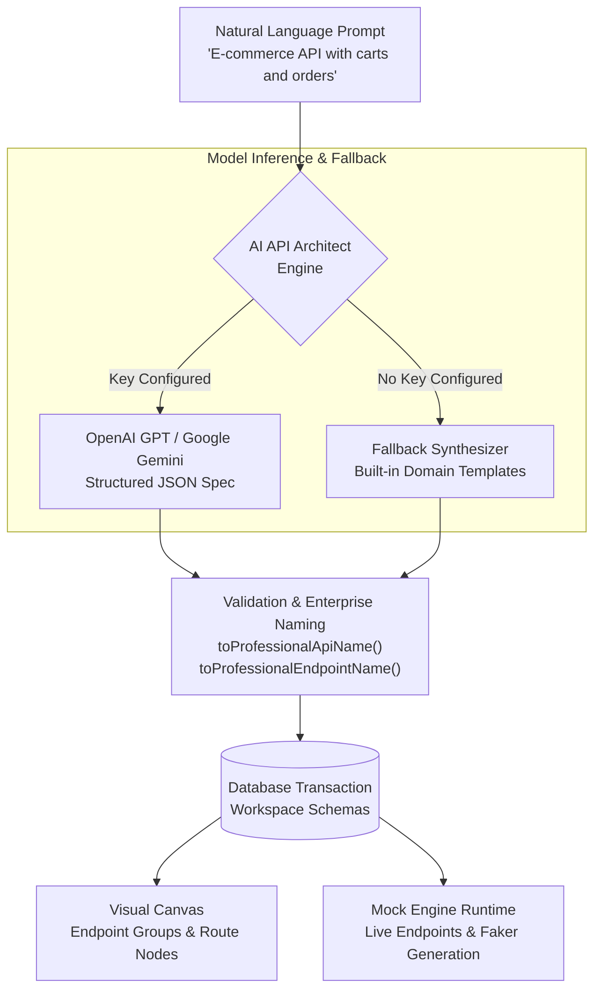

The **AI API Architect** is Fack API's intelligent design engine that converts plain English descriptions into production-grade REST API architectures. Instead of manually clicking through menus or typing repetitive schema definitions, you describe what your application needs, and the engine automatically scaffolds the entire API topology.

Whether you are designing a complex e-commerce backend, a multi-tenant SaaS platform, or a microservice ecosystem, the AI API Architect generates structured endpoint groups, RESTful routes with correct HTTP methods, and rich JSON response schemas wired with contextual [Faker Providers](/docs/schemas/faker-providers).



## Generated Architecture Assets

When you submit a design prompt, the AI API Architect synthesizes a complete workspace contract comprising:

- **Workspace & Service Grouping**: Logical organization of microservice domains into clean, isolated [Endpoint Groups](/docs/canvas/nodes#endpoint-group-nodes).
- **RESTful Routes & Methods**: Idiomatic HTTP verbs (`GET`, `POST`, `PUT`, `PATCH`, `DELETE`) with standard status codes (`200 OK`, `201 Created`, `204 No Content`, `404 Not Found`).
- **Dynamic Response Schemas**: Deeply nested JSON schemas annotated with `x-faker` bindings to emit realistic names, emails, UUIDs, currencies, and timestamps.
- **Path Parameter Conventions**: Standardized route paths using kebab-case resources and parameterized identifiers (e.g., `/orders/:orderId/items`).
- **Professional Enterprise Naming**: Normalization routines that convert raw input tags into clean, publication-ready titles (e.g., transforming `auth` into "Identity & Access Management").

## Accessing the AI Architect

You can open the AI API Architect modal from two convenient locations within Fack API:

1. **Dashboard Toolbar**: Click the **AI Architect** button (sparkles icon) in the top project navigation bar.
2. **Visual Canvas**: Click the **AI Generate** action in the canvas header or press `Ctrl + K` / `Cmd + K` to open the command palette and select **Launch AI Architect**.

Once opened, provide a high-level description of your API requirements, review the proposed architecture preview, and click **Generate Workspace** to apply the changes directly to your active project.

## Provider Configuration & Fallback Mode

The AI API Architect supports leading generative AI models from OpenAI and Google Gemini. You can supply your API credentials via environment variables or workspace settings.

<Callout type="info">
**API Key Configuration**
To use dynamic generative models, set `OPENAI_API_KEY` (for OpenAI GPT models) or `GOOGLE_GENERATIVE_AI_KEY` (for Google Gemini) in your local `.env` configuration. If no AI key is configured, Fack API automatically activates the **Fallback Synthesizer**, which safely generates rich, realistic mock APIs using built-in domain templates without requiring external network calls or billing accounts.
</Callout>

### Environment Variables

Configure your preferred AI provider in your environment:

```bash title=".env"
# OpenAI Configuration
OPENAI_API_KEY="sk-..."

# Google Gemini Configuration
GOOGLE_GENERATIVE_AI_KEY="AIzaSy..."
```

When both keys are present, you can switch between providers directly in the AI Architect modal interface.

## Next Steps

Explore best practices for prompting, understand how the multi-stage streaming pipeline works, or examine the built-in domain templates:

<Cards>
  <Card
    title="Crafting Effective Prompts"
    href="/docs/ai-architect/prompts"
    description="Learn how to structure natural language prompts for optimal API depth, relationships, and data quality."
  />
  <Card
    title="Generation Pipeline"
    href="/docs/ai-architect/pipeline"
    description="Explore the 6-stage streaming synthesis engine, schema normalization rules, and conflict resolution."
  />
  <Card
    title="Domain Templates"
    href="/docs/ai-architect/templates"
    description="Inspect the built-in e-commerce, social media, and food delivery templates used by the offline fallback synthesizer."
  />
</Cards>
