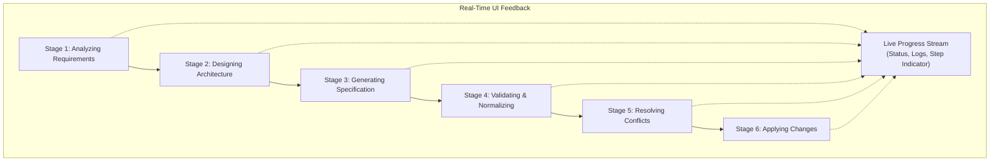
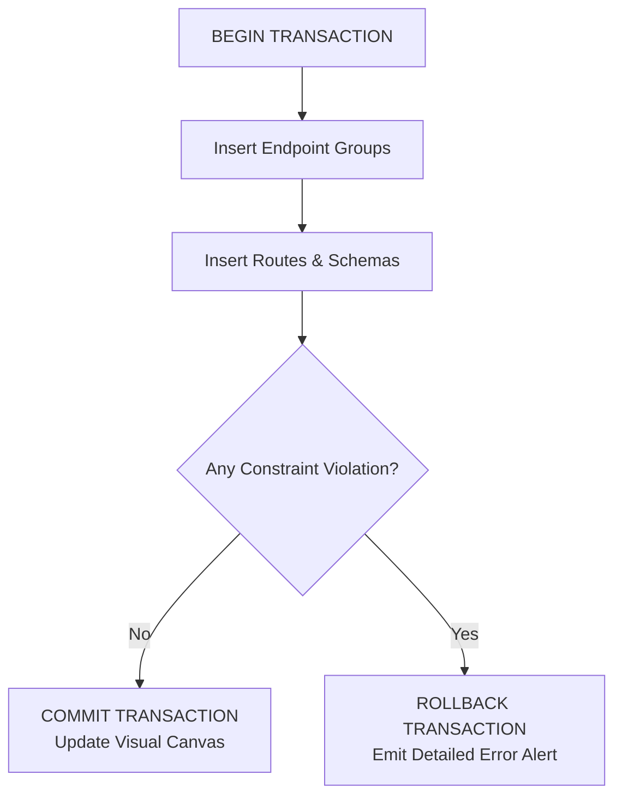

The AI API Architect processes requests through a deterministic, **6-stage streaming pipeline**. Rather than presenting a generic loading spinner, the architecture engine streams real-time status updates and execution metrics to the client as each phase completes.

This pipeline ensures that natural language prompts are systematically refined, validated against REST best practices, and safely written to the database without corrupting existing workspace configurations.



## The 6-Stage Streaming Pipeline

The synthesis engine executes the following six stages sequentially:

<Steps>
  <Step>
    ### 1. Analyzing Requirements
    The engine ingests the natural language input, parses semantic intent, and decomposes the request into core business entities, parent-child relations, and operational domains. It determines the bounded context (e.g., e-commerce vs. logistics) to contextualize naming schemes and data types.
  </Step>

  <Step>
    ### 2. Designing Architecture
    The parsed intent is expanded into an architectural blueprint. The engine creates a hierarchical topology mapping out logical microservice boundaries ([Endpoint Groups](/docs/canvas/nodes#endpoint-group-nodes)), route hierarchies, expected HTTP status codes, and cross-resource links.
  </Step>

  <Step>
    ### 3. Generating Specification
    The engine invokes the configured LLM (OpenAI GPT or Google Gemini) with structured schema constraints (JSON mode / function calling). It generates comprehensive specifications covering endpoints, HTTP verbs, URL paths, and JSON response schemas embedded with `x-faker` provider bindings.
  </Step>

  <Step>
    ### 4. Validating & Normalizing
    The generated raw specification undergoes rigorous programmatic normalization:
    - **Resource Paths**: Enforces plural nouns and kebab-case URL formatting (e.g., `/user-profiles` instead of `/user_profile`).
    - **Faker Bindings**: Verifies all `x-faker` annotations against Fack API's 1,500+ registered Faker providers, substituting invalid signatures with safe fallbacks.
    - **HTTP Methods**: Guarantees idiomatic method conventions (`GET` for retrieval, `POST` for creation, `PUT`/`PATCH` for updates, `DELETE` for removal).
    - **Enterprise Naming**: Runs string normalizers to convert informal tags into publication-ready titles.
  </Step>

  <Step>
    ### 5. Resolving Conflicts
    The pipeline inspects the current workspace in the database. If a generated route path and method collide with an existing route (for example, a pre-existing `GET /products`), the system pauses and triggers a **Conflict Resolution Dialog**. You can choose to:
    - **Overwrite**: Replace existing routes with the newly generated version.
    - **Merge**: Keep existing routes and only insert non-colliding new routes.
    - **Prefix / Rename**: Namespace new endpoints to avoid overlap.
  </Step>

  <Step>
    ### 6. Applying Changes
    Once validated and confirmed, the entire endpoint group and route collection is persisted to the database within an **atomic transaction**. If any database constraint fails, the transaction immediately rolls back, leaving your workspace completely intact.
  </Step>
</Steps>

## Real-Time Streaming Progress UI

While the pipeline executes, the AI Architect modal renders an interactive streaming progress tracker:

- **Active Step Indicator**: Displays animated status badges showing which stage is running, completed, or awaiting resolution.
- **Payload Preview**: Progressively streams the generated endpoint tree and routes as they are validated by Stage 4.
- **Execution Logs**: A collapsible developer log drawer provides granular timings (in milliseconds) and model token consumption metrics.

## Professional Naming Engine

To guarantee consistent, enterprise-grade naming conventions across all generated APIs, the pipeline routes all raw tags through dedicated normalization routines:

### `toProfessionalApiName()`

Transforms informal or brief prompts into formal, publication-ready API titles:

```ts
// Example transformations
toProfessionalApiName("shop")
// Output: "Storefront & Commerce Operations Platform API"

toProfessionalApiName("patient tracking")
// Output: "Clinical Healthcare & Patient Management Platform API"

toProfessionalApiName("ride share")
// Output: "Urban Mobility & Fleet Dispatch Platform API"
```

### `toProfessionalEndpointName()`

Maps resource slugs and raw paths to descriptive domain titles for canvas nodes:

| Raw Resource Slug | Generated Endpoint Group Title | Base Path |
| :--- | :--- | :--- |
| `products` | **Product Catalog** | `/products` |
| `cart` / `carts` | **Shopping Carts** | `/carts` |
| `orders` | **Order Management** | `/orders` |
| `auth` | **Identity & Access Management** | `/auth` |
| `users` | **User Directory & Profiles** | `/users` |
| `analytics` | **Telemetry & Platform Analytics** | `/analytics` |

## Transaction Safety & Error Handling

All write operations in Stage 6 run inside an ACID-compliant transaction:



<Callout type="warn">
If an invalid JSON Schema or schema compilation error is detected during normalization or transaction execution, the entire generation batch is discarded and no orphan records are created in your workspace.
</Callout>
