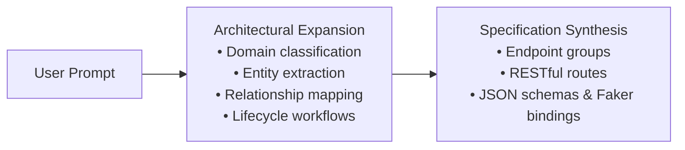
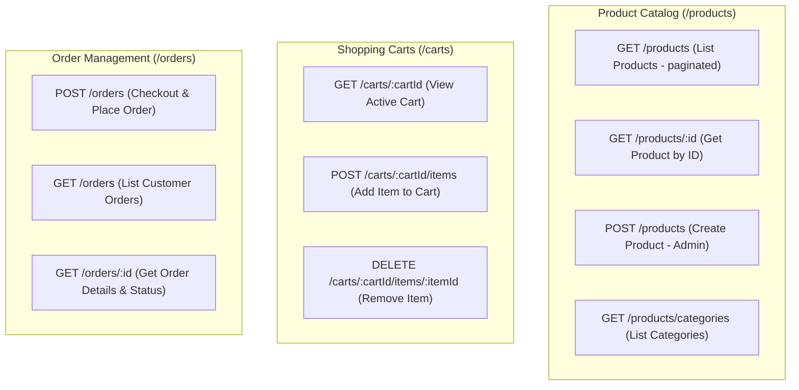

The AI API Architect uses an intelligent two-pass synthesis engine: before generating routes and schemas, it first expands your input prompt into a comprehensive **architectural specification**. The richer and more descriptive your initial prompt is, the more detailed, realistic, and interconnected the resulting API will be.

Understanding how the model interprets your prompt helps you craft descriptions that produce production-ready API topologies on your first attempt.

## How Prompt Expansion Works

When you submit a prompt, the engine does not perform a simple keyword search. Instead, it analyzes your intent and expands the prompt through several architectural dimensions:



During expansion, the engine automatically:
- Identifies primary business domains and bounded contexts.
- Infers core entities, dependent child entities, and their cardinalities (1:1, 1:N, M:N).
- Maps lifecycle actions (creation, retrieval, state changes, deletion) to idiomatic REST verbs.
- Assigns realistic field types and semantic Faker providers to entity attributes.

## Tips for High-Quality Prompts

Follow these core practices to obtain the most accurate and comprehensive API designs:

### 1. Specify Entities and Their Relationships
Explicitly identify the primary resources and how they interact. Mention parent-child hierarchies (e.g., an order has multiple line items, a restaurant owns multiple menus).

### 2. Declare the Business Domain
Mention the industry or domain context (such as e-commerce, healthcare, fintech, IoT telemetry, logistics, or HR management). This gives the LLM context to select domain-specific Faker providers like `finance.accountNumber`, `commerce.price`, or `location.streetAddress`.

### 3. Describe User Actions and Workflows
Focus on user journeys and state transitions rather than static database tables. For example:
- *"Users submit an order, receive a confirmation invoice, and track shipment status"*
- *"Drivers accept delivery requests, update dispatch status, and log GPS coordinates"*

### 4. Include Operational Capabilities
State requirements for pagination, full-text search, filtering, and sorting. The AI will incorporate query parameters and wrapped envelope responses:
- *"Support paginated listings with filtering by category and status"*
- *"Include full-text search across product titles and tags"*

## Good vs. Bad Prompts

Examine how prompt specificity directly impacts the resulting API architecture:

### Ineffective Prompts

<Tabs items={["Vague Input", "Database-Centric"]}>
  <Tab value="Vague Input">
    **Prompt**: *"Make an API"*

    **Why it underperforms**:
    - Zero domain context or entity definitions.
    - The model must guess the entire application scope, resulting in generic `GET /items` endpoints with basic string fields.
  </Tab>
  <Tab value="Database-Centric">
    **Prompt**: *"Users table with CRUD"*

    **Why it underperforms**:
    - Focuses on database schema terminology rather than REST API design.
    - Generates flat, single-table endpoints (`GET /users`, `POST /users`) without contextual relations (roles, sessions, preferences, security tokens).
  </Tab>
</Tabs>

### Recommended Prompts

| Business Domain | Example Prompt | Key Entities Generated |
| :--- | :--- | :--- |
| **E-Commerce** | *"Create an e-commerce API where users can browse products, add products to carts, and place orders with checkout status tracking."* | Products, Categories, Carts, Cart Items, Orders, Payments |
| **Social Media** | *"Build a social media platform with user profiles, posts, comments, likes, and follower relationships."* | Users, Profiles, Posts, Feeds, Comments, Reactions, Followers |
| **Food Delivery** | *"Design a food delivery API with restaurants, menus, orders, delivery tracking, and driver management."* | Restaurants, Menus, Menu Items, Orders, Deliveries, Drivers |

## Real-World Walkthrough

Here is a complete example showing a prompt and the resulting structured architecture synthesized by the AI Architect:

### Input Prompt

```text
"Create an e-commerce API where users can browse products, add products to carts, and place orders"
```

### Generated Architecture Topology

The engine expands this prompt into three dedicated [Endpoint Groups](/docs/canvas/nodes#endpoint-group-nodes) containing 10 distinct routes:



### Generated Schema Sample

For the `GET /products/:id` route, the AI Architect automatically generates a typed schema with semantic [Faker.js bindings](/docs/schemas/faker-providers):

```json title="Product Response Schema"
{
  "type": "object",
  "properties": {
    "id": { "type": "string", "x-faker": "string.uuid" },
    "title": { "type": "string", "x-faker": "commerce.productName" },
    "description": { "type": "string", "x-faker": "commerce.productDescription" },
    "price": { "type": "number", "x-faker": "commerce.price" },
    "category": { "type": "string", "x-faker": "commerce.department" },
    "sku": { "type": "string", "x-faker": "string.alphanumeric" },
    "inStock": { "type": "boolean" },
    "rating": { "type": "number", "x-faker": "number.float" },
    "createdAt": { "type": "string", "x-faker": "date.past" }
  },
  "required": ["id", "title", "price", "sku", "inStock"]
}
```

<Callout type="info">
Once generated on the [Visual Canvas](/docs/canvas), any route's schema can be fine-tuned or extended using the visual [Schema Builder](/docs/schemas).
</Callout>
