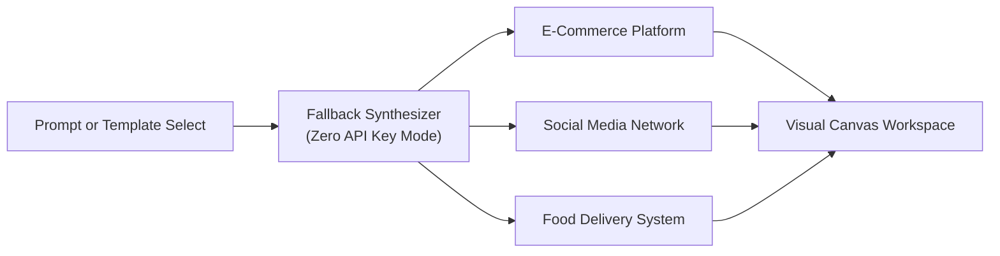

When running Fack API without an `OPENAI_API_KEY` or `GOOGLE_GENERATIVE_AI_KEY`, you can still generate complete, realistic mock APIs instantly. The **Fallback Synthesizer** uses built-in, production-tested **Domain Templates** to scaffold comprehensive API architectures in offline environments.

Each template features normalized endpoint groups, standard HTTP verbs, realistic status codes, and deeply typed JSON schemas backed by contextual [Faker.js data providers](/docs/schemas/faker-providers).



## Built-In Domain Templates

Fack API bundles three comprehensive reference domain templates:

<Accordions>
  <Accordion title="E-Commerce Operations Platform">
    A multi-service retail architecture supporting product catalog discovery, shopping session state, order fulfillment, and customer account management.

    #### Endpoint Groups & Routes
    - **Product Catalog** (`/products`)
      - `GET /products` (200 OK) — Paginated product catalog with category and price filters
      - `GET /products/:id` (200 OK) — Detailed product profile with SKU, inventory status, and pricing
      - `POST /products` (201 Created) — Create a new product inventory item
    - **Shopping Carts** (`/carts`)
      - `GET /carts` (200 OK) — Retrieve cart state for current session
      - `POST /carts` (201 Created) — Initialize a new shopping cart
      - `PUT /carts/:id` (200 OK) — Update item quantities and apply discount codes
    - **Order Management** (`/orders`)
      - `GET /orders` (200 OK) — List order history with payment and fulfillment status
      - `POST /orders` (201 Created) — Convert active cart into confirmed checkout order
      - `GET /orders/:id` (200 OK) — Order details, tracking numbers, and line items
    - **Customer Accounts** (`/customers`)
      - `GET /customers` (200 OK) — List registered customer accounts
      - `POST /customers` (201 Created) — Register a new customer
      - `GET /customers/:id` (200 OK) — Customer profile, billing addresses, and loyalty points

    #### Sample Faker Schema (`GET /orders/:id`)
    ```json title="Order Detail Schema"
    {
      "type": "object",
      "properties": {
        "orderId": { "type": "string", "x-faker": "string.uuid" },
        "status": { "type": "string", "x-faker": "helpers.arrayElement(['pending', 'processing', 'shipped', 'delivered'])" },
        "totalAmount": { "type": "number", "x-faker": "commerce.price" },
        "currency": { "type": "string", "x-faker": "finance.currencyCode" },
        "customerEmail": { "type": "string", "x-faker": "internet.email" },
        "placedAt": { "type": "string", "x-faker": "date.recent" }
      },
      "required": ["orderId", "status", "totalAmount", "currency"]
    }
    ```
  </Accordion>

  <Accordion title="Social Media & Community Platform">
    A high-throughput social networking architecture featuring member identities, multi-media content streams, discussions, and friendship graphs.

    #### Endpoint Groups & Routes
    - **User Profiles** (`/users`)
      - `GET /users` (200 OK) — Search and browse community member profiles
      - `GET /users/:id` (200 OK) — Retrieve user profile, biography, and follower counters
      - `PATCH /users/:id` (200 OK) — Update personal bio, display name, and avatar URL
    - **Posts & Feeds** (`/posts`)
      - `GET /posts` (200 OK) — Public timeline listing recent publications
      - `GET /feed` (200 OK) — Personalized user feed sorted by engagement algorithms
      - `POST /posts` (201 Created) — Publish a new text post or media link
      - `DELETE /posts/:id` (204 No Content) — Remove an authored post
    - **Comments & Replies** (`/comments`)
      - `GET /posts/:id/comments` (200 OK) — Threaded discussion list for a given post
      - `POST /posts/:id/comments` (201 Created) — Submit a reply comment
    - **Social Connections** (`/connections`)
      - `GET /users/:id/followers` (200 OK) — List members following a given user
      - `POST /users/:id/follow` (200 OK) — Follow or unfollow target user

    #### Sample Faker Schema (`GET /users/:id`)
    ```json title="User Profile Schema"
    {
      "type": "object",
      "properties": {
        "userId": { "type": "string", "x-faker": "string.uuid" },
        "username": { "type": "string", "x-faker": "internet.userName" },
        "fullName": { "type": "string", "x-faker": "person.fullName" },
        "avatarUrl": { "type": "string", "x-faker": "image.avatar" },
        "bio": { "type": "string", "x-faker": "person.bio" },
        "followersCount": { "type": "integer", "x-faker": "number.int({'min': 10, 'max': 50000})" }
      },
      "required": ["userId", "username", "fullName"]
    }
    ```
  </Accordion>

  <Accordion title="On-Demand Food Delivery Platform">
    A logistics and delivery platform modeling partner restaurants, dynamic culinary menus, customer dispatch orders, and real-time courier tracking.

    #### Endpoint Groups & Routes
    - **Restaurant Directory** (`/restaurants`)
      - `GET /restaurants` (200 OK) — Search nearby partner restaurants by cuisine and rating
      - `GET /restaurants/:id` (200 OK) — Operating hours, address, and sanitation grades
    - **Menu Management** (`/menus`)
      - `GET /restaurants/:id/menu` (200 OK) — Hierarchical menu categories (Appetizers, Mains, Drinks)
      - `POST /restaurants/:id/menu/items` (201 Created) — Add a new culinary item with modifiers
    - **Order Processing** (`/orders`)
      - `GET /orders` (200 OK) — Active delivery orders and order history
      - `POST /orders` (201 Created) — Submit delivery order with delivery instructions
      - `GET /orders/:id` (200 OK) — Real-time order status and item breakdown
    - **Delivery Tracking** (`/tracking`)
      - `GET /orders/:id/tracking` (200 OK) — Courier coordinates, ETA, and route path
      - `PATCH /orders/:id/status` (200 OK) — Update order lifecycle state
    - **Driver Management** (`/drivers`)
      - `GET /drivers` (200 OK) — List available couriers within delivery geofence
      - `GET /drivers/:id/active-orders` (200 OK) — Inspect active dispatch queue for courier

    #### Sample Faker Schema (`GET /orders/:id/tracking`)
    ```json title="Delivery Tracking Schema"
    {
      "type": "object",
      "properties": {
        "trackingId": { "type": "string", "x-faker": "string.uuid" },
        "deliveryStatus": { "type": "string", "x-faker": "helpers.arrayElement(['preparing', 'driver_assigned', 'in_transit', 'delivered'])" },
        "estimatedArrivalMinutes": { "type": "integer", "x-faker": "number.int({'min': 5, 'max': 45})" },
        "driverLatitude": { "type": "number", "x-faker": "location.latitude" },
        "driverLongitude": { "type": "number", "x-faker": "location.longitude" }
      },
      "required": ["trackingId", "deliveryStatus", "estimatedArrivalMinutes"]
    }
    ```
  </Accordion>
</Accordions>

## Customizing Generated Templates

Domain templates provide an immediate foundation that you can tailor to your project's specific requirements:

- **Modify Endpoints**: Rename route paths or change HTTP verbs directly from the [Visual Canvas](/docs/canvas).
- **Edit Schemas**: Add custom business fields or alter faker generators using the [Schema Builder](/docs/schemas).
- **Simulate Chaos**: Test application resilience by attaching delay or error rules to template routes using [Chaos Engineering](/docs/chaos).
- **Export TypeScript**: Generate corresponding frontend client interfaces using the [TypeScript Interface Generator](/docs/schemas/typescript).
