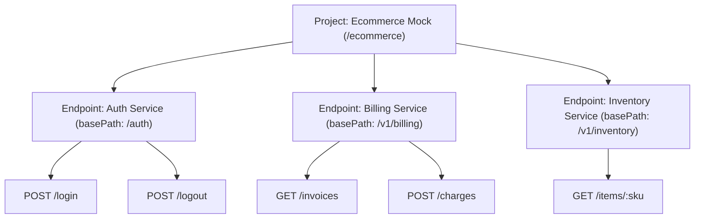
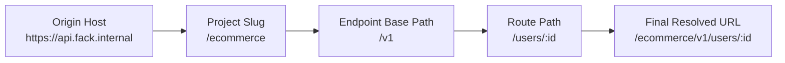

In Fack API, **Endpoints** (or **Endpoint Groups**) represent logical service boundaries within a project workspace. Rather than flattening dozens of unrelated routes into a single list, endpoint groups organize related routes into distinct domains such as *Auth Service*, *Billing Service*, or *Inventory Service*.

## Logical Microservice Boundaries

Modern backend architectures often split responsibilities across independent microservices or versioned API modules. Endpoint groups replicate this structure inside your mock workspace:

### Key Endpoint Properties

Each endpoint group contains three core metadata properties:

| Property | Type | Description | Example |
| :--- | :--- | :--- | :--- |
| `name` | String | A descriptive label identifying the service or domain. | `Billing Service` |
| `description` | String | Optional markdown documentation or notes on service ownership. | `Handles Stripe checkouts & subscriptions` |
| `basePath` | String | Common URL path prefix prepended to all child routes in this group. | `/v1/billing` |

## Base Path URL Composition

When a client sends an HTTP request to Fack API, the final route is resolved by concatenating the project identifier, the endpoint's `basePath`, and the route's individual `path`:

### URL Composition Examples

| Project Slug | Endpoint `basePath` | Route `path` | Final Mock URL |
| :--- | :--- | :--- | :--- |
| `ecommerce` | `/v1` | `/users/:id` | `https://api.fack.internal/ecommerce/v1/users/:id` |
| `ecommerce` | `/auth` | `/login` | `https://api.fack.internal/ecommerce/auth/login` |
| `payment-gateway` | `/v2/webhooks` | `/stripe` | `https://api.fack.internal/payment-gateway/v2/webhooks/stripe` |
| `analytics` | `/` | `/ping` | `https://api.fack.internal/analytics/ping` |

<Callout type="info">
If your deployment utilizes subdomain routing, the project slug is mapped directly to the subdomain (e.g., `https://ecommerce.mock.fack-api.internal/v1/users/:id`).
</Callout>

## Endpoint Group CRUD Operations

You can manage endpoint groups from either the [Visual Canvas](/docs/canvas) or the dedicated **Endpoints** dashboard (`/projects/[slug]/endpoints`).

<Steps>
  <Step>
    ### Creating a New Endpoint Group
    Navigate to the **Endpoints** page and click **Create Endpoint Group**. Enter the service `name`, optional `description`, and the designated `basePath` (e.g., `/v1/payments`). Click **Save** to generate the group container.
  </Step>

  <Step>
    ### Modifying Service Configuration
    To change an existing group's name or prefix, select the endpoint in the dashboard and update its `basePath`. All existing routes under this group immediately reflect the new URL prefix across the mock engine and canvas.
  </Step>

  <Step>
    ### Repositioning & Resizing on Canvas
    On the [Visual Canvas](/docs/canvas), click the endpoint container to reveal resize handles. Drag the container to reorganize your microservice architecture diagram.
  </Step>

  <Step>
    ### Deleting an Endpoint Group
    Click the menu button on the endpoint card and choose **Delete Group**. Confirm the deletion in the prompt dialog.
  </Step>
</Steps>

## Cascading Deletion & Safety

Endpoint groups maintain a strict hierarchical relationship with their nested routes in the database.

<Callout type="warn">
**Warning: Cascading Route Deletion**
Deleting an endpoint group triggers an automatic cascade deletion (`onDelete: "cascade"` in the database schema). All child routes, response schemas, and chaos engineering rules belonging to the deleted endpoint group will be permanently removed.
</Callout>

Before deleting an endpoint group:
1. Verify whether any critical client mock tests depend on child routes in that group.
2. If you only wish to temporarily disable the service, use the **Enabled / Disabled** switch on individual [Route Nodes](/docs/canvas/nodes) instead of deleting the group.
