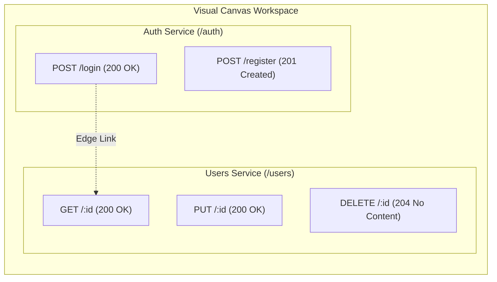

The **Visual Canvas** is Fack API's interactive workspace for exploring, designing, and orchestrating mock API architectures. Powered by `@xyflow/react` (React Flow), the canvas provides an infinite 2D environment where your endpoints and routes exist as connected, configurable visual nodes rather than static tables or configuration files.

## Visual Workspace Features

The canvas provides fluid navigation tools optimized for complex microservice layouts and multi-route architectures:

- **Infinite Pan & Zoom**: Navigate across large microservice architectures with mouse dragging, trackpad gestures, or dedicated zoom controls.
- **Interactive MiniMap**: Located in the bottom-right corner, the minimap displays a bird's-eye view of your entire workspace with live viewport highlighting.
- **Adaptive Grid Background**: An engineered dot-matrix canvas grid provides spatial reference, dynamically adjusting contrast in light and dark themes.
- **Node Dragging & Snapping**: Drag individual routes within endpoint containers or move entire endpoint service groups across the canvas.
- **Dynamic Auto-Layout**: Route nodes automatically stack within parent endpoint groups, resizing the container height based on route counts.

## Canvas Architecture

The canvas organizes API architectures hierarchically into two primary node types and directional edges:

1. **Endpoint Group Nodes**: Visual bounding boxes that represent logical service or microservice boundaries (e.g., `Users`, `Payments`, `Billing`). Each group defines a common `basePath` prefix.
2. **Route Nodes**: Nested child nodes representing individual HTTP endpoints (such as `GET /users/:id` or `POST /auth/login`). They display method badges, HTTP status codes, and active chaos rules.
3. **Canvas Edges**: Directed, dashed lines connecting route nodes. Use edges to map data flow relationships, sequential workflows, or dependencies between API operations.

## Canvas Controls Toolbar

The bottom-left controls bar and top project navigation bar provide quick actions to control viewport framing and persistence:

| Control | Action | Shortcut / Description |
| :--- | :--- | :--- |
| **Zoom In** | `+` | Zooms the canvas closer to inspect individual route configurations. |
| **Zoom Out** | `-` | Pulls the camera back to view multiple service groups simultaneously. |
| **Fit View** | Recenter | Frames all nodes on the canvas into the current browser viewport. |
| **Save Layout** | Manual Save | Immediately commits all node coordinates, edge connections, and camera zoom. |
| **Add Route** | Modal Trigger | Opens the [Quick Add Route](/docs/canvas/adding-routes) dialog. |

<Callout type="info">
**Automatic State Persistence**
Canvas state is automatically synchronized and saved per project workspace in the database. Node coordinates, manual resizing dimensions, edge connections, and viewport pan/zoom levels persist across browser sessions and team members.
</Callout>

## Interactive Route Editing

Clicking any route node selects it on the canvas and broadcasts the route selection across your workspace:

- **Quick Selection**: Highlights the active route and populates real-time mock URL preview links.
- **Side Edit Bar**: Clicking the pencil icon (`Edit Route`) slides out the comprehensive route editor drawer, where you can modify the [Schema Builder](/docs/schemas), configure [Chaos Engineering](/docs/chaos), and define custom response headers.
- **Instant Toggle**: Toggle routes active or inactive directly from the canvas without deleting their configuration.

## Next Steps

Explore the detailed guides below to master node configuration, route creation, and endpoint management:

<Cards>
  <Card
    title="Route & Endpoint Nodes"
    href="/docs/canvas/nodes"
    description="Learn about color-coded badges, visual indicators, handles, and node anatomy."
  />
  <Card
    title="Creating Routes"
    href="/docs/canvas/adding-routes"
    description="Step-by-step walkthrough of the Quick Add modal and path parameter syntax."
  />
  <Card
    title="Managing Service Endpoints"
    href="/docs/canvas/endpoints"
    description="Organize microservices, configure base paths, and understand cascading operations."
  />
  <Card
    title="Schema Builder"
    href="/docs/schemas"
    description="Configure realistic mock data schemas with 1,500+ Faker.js providers."
  />
</Cards>
