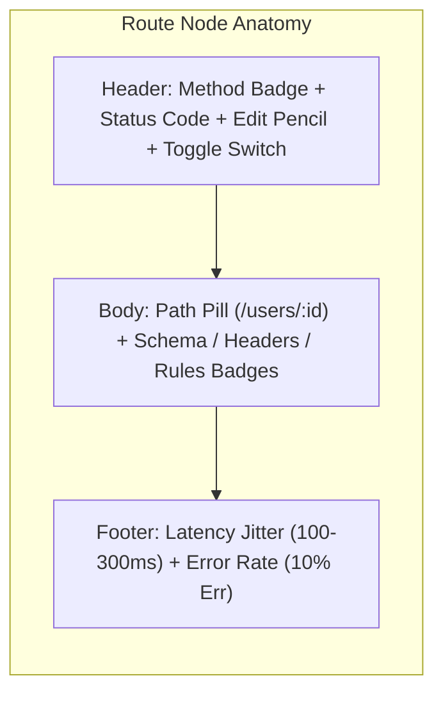
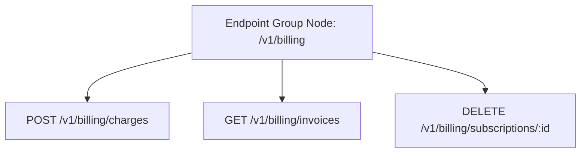

Fack API's visual canvas uses two primary custom node types: **Route Nodes** (`routeNode`) representing individual HTTP endpoints, and **Endpoint Group Nodes** (`endpointGroup`) representing service boundaries.

## 1. Route Node (`routeNode`)

Route nodes represent operational mock endpoints. Each route node is an interactive card displaying the HTTP method, endpoint sub-path, HTTP response status, active chaos parameters, and toggle controls.

### Color-Coded Method Badges

Each HTTP method features a distinct color system applied to its badge, left border highlight, and glowing status dot:

| Method | Badge Color | Left Border | Typical Usage |
| :--- | :--- | :--- | :--- |
| `GET` | **Emerald / Green** | `border-l-emerald-500` | Fetching resource entities or collections |
| `POST` | **Blue** | `border-l-blue-500` | Creating resources or executing actions |
| `PUT` | **Amber / Orange** | `border-l-amber-500` | Replacing existing resource records |
| `DELETE` | **Rose / Red** | `border-l-rose-500` | Removing or archiving entities |
| `PATCH` | **Purple** | `border-l-purple-500` | Applying partial modifications to resources |

### Status Code Badges

The status code badge provides immediate visual confirmation of the route's default HTTP status code:

- **`2xx Success` (Emerald)**: `200 OK`, `201 Created`, `204 No Content`
- **`3xx Redirection` (Amber)**: `301 Moved Permanently`, `302 Found`, `304 Not Modified`
- **`4xx Client Error` (Rose)**: `400 Bad Request`, `401 Unauthorized`, `404 Not Found`
- **`5xx Server Error` (Purple Animated)**: `500 Internal Server Error`, `502 Bad Gateway`, `503 Service Unavailable` (pulses to indicate severe failure simulation)

### Visual Indicators Reference

Route nodes surface operational details through compact visual indicators:

| Visual Indicator | Element Location | Description |
| :--- | :--- | :--- |
| **Method Badge** | Top Left | Color-coded HTTP verb with a glowing pulse dot when the route is enabled. |
| **Status Code** | Top Center | Monospace HTTP status code accompanied by a semantic status icon. |
| **Pencil Button** | Top Right | Opens the slide-out [Edit Bar](/docs/schemas) drawer to edit schemas, headers, and rules. |
| **Enable/Disable Switch** | Top Right | Toggle switch. Disabling dims the node (`opacity-60 grayscale`) and turns off mock responses without deleting the node. |
| **Path Pill** | Body | Monospace route sub-path (e.g. `/:id` or `/checkout`). Supports dynamic parameter tokens. |
| **JSON Badge** | Body (Feature) | Displays `JSON (N)` showing the count of schema properties configured. |
| **Headers Badge** | Body (Feature) | Displays `Headers (N)` indicating active custom response headers. |
| **Rules Badge** | Body (Feature) | Displays `Rules (N)` indicating conditional response rules. |
| **Latency Jitter** | Footer Left | Displays simulated network latency range (e.g. `100-300ms`) with clock icon. |
| **Error Rate** | Footer Right | Displays simulated failure injection percentage (e.g. `10% Err`) with alert icon. |
| **Handle Connectors** | Left / Right | Target and source handle ports for dragging directed relationship edges. |

## 2. Endpoint Group Node (`endpointGroup`)

Endpoint Group nodes serve as visual microservice boundaries and parent containers on the canvas. They logically cluster related routes under a common service identity and URL base path.

### Group Container Capabilities

- **Logical Organization**: Groups routes by business domain (e.g., `Authentication`, `Billing`, `Catalog`, `Shipping`).
- **Base Path Scope**: Defines a shared `basePath` (such as `/v1/auth` or `/api/v2`) automatically prepended to all child routes.
- **Dynamic Resizing**: Endpoint containers automatically expand in height as new routes are added (`110px + routes.length * 96px`). When selected, interactive resize handles allow custom container dimensions.
- **Visual Styling**: Rendered with an engineered subtle micro-grid, dashed glowing boundary border, and a folder icon indicating service encapsulation.

<Callout type="info">
**Hierarchical Nesting & Movement**
When you drag an Endpoint Group node across the canvas, all nested child route nodes move with it automatically. Individual route nodes can also be repositioned within the group's interior boundary.
</Callout>

## Editing Nodes via the Edit Bar

Clicking any route node or selecting the pencil icon immediately opens the **Edit Bar** sheet drawer on the right side of the canvas:

- Modify the HTTP method, path, and default status code.
- Open the [Schema Builder](/docs/schemas) to define dynamic response shapes with 1,500+ Faker.js providers.
- Configure [Chaos Engineering](/docs/chaos) rules, including minimum/maximum latency and error rate percentages.
- Set up custom response headers (`Content-Type`, `X-RateLimit-Limit`, `Cache-Control`).
- Define conditional rules that return distinct status codes and payloads based on incoming query parameters or headers.
