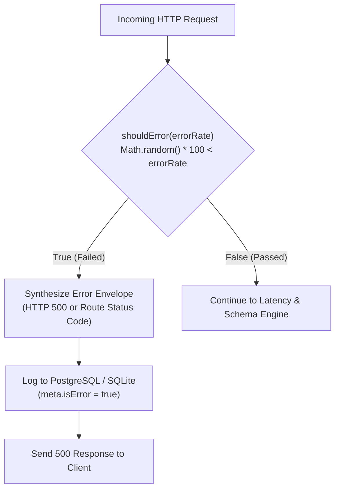

Production web applications must fail gracefully when downstream services become temporarily unavailable. If an API returns a `500 Internal Server Error`, does your frontend display an informative fallback, notify the user with a toast, or crash the whole screen with an unhandled runtime error?

**Error Rate Simulation** in Fack API allows you to assign a failure probability (`0%` to `100%`) to any route. The mock engine evaluates every incoming request against this probability, randomly failing requests to simulate microservice degradation.

## How Error Simulation Works

Error simulation is evaluated on every incoming request using a lightweight, non-blocking check:



Under the hood, the engine evaluates the percentage threshold:

```ts title="lib/mock-engine.ts"
export function shouldError(errorRate: number): boolean {
  if (errorRate <= 0) return false;
  if (errorRate >= 100) return true;
  return Math.random() * 100 < errorRate;
}
```

When a request is selected to fail:
1. The engine checks the route's configured status code. If the route status is already `4xx` or `5xx` (e.g., `503 Service Unavailable`), that code is retained. Otherwise, it defaults to `500 Internal Server Error`.
2. Execution immediately halts, bypassing schema generation and latency injection.
3. The error is recorded in the [Request Logs](/docs/mock-engine) with `meta.isError: true` for auditability.

<Callout type="warn">
  Setting an error rate of **100%** will cause **ALL** incoming requests on that route to fail. While this is useful for simulating complete backend outages, remember to lower or disable the error rate once your resilience tests are complete.
</Callout>

## Error Response Envelope

When an error is simulated, Fack API returns an error envelope with standardized diagnostic fields:

```json title="HTTP 500 Internal Server Error"
{
  "error": true,
  "statusCode": 500,
  "message": "Simulated server error (Chaos Monkey)",
  "timestamp": "2026-09-22T01:14:15.000Z"
}
```

The response includes the standard platform CORS headers and `X-Powered-By: Fack API's`, ensuring frontend clients can parse the JSON error body without encountering cross-origin exceptions.

## Frontend Resilience Scenarios

Simulating intermittent errors allows you to validate several critical frontend architecture patterns:

### 1. Error Boundaries & Fallback UI

Verify that React `<ErrorBoundary>` or Next.js `error.tsx` components isolate UI failures to the specific card or widget without crashing the parent layout:

```tsx title="components/ProductWidget.tsx"
import { ErrorBoundary } from "react-error-boundary";

function ProductFallback({ error, resetErrorBoundary }: any) {
  return (
    <div className="p-4 rounded-md border border-destructive/50 bg-destructive/10 text-destructive">
      <p className="text-sm font-medium">Failed to load product catalog.</p>
      <button onClick={resetErrorBoundary} className="mt-2 text-xs underline">
        Try Again
      </button>
    </div>
  );
}

export function ProductWidget() {
  return (
    <ErrorBoundary FallbackComponent={ProductFallback}>
      <ProductList />
    </ErrorBoundary>
  );
}
```

### 2. Automatic Exponential Retry Logic

Test whether data-fetching libraries like TanStack Query automatically retry failed queries with exponential backoff before surfacing an error to the user:

```ts title="hooks/useProducts.ts"
import { useQuery } from "@tanstack/react-query";

export function useProducts() {
  return useQuery({
    queryKey: ["products"],
    queryFn: async () => {
      const res = await fetch("http://localhost:3000/api/mock/acme/v1/products");
      if (!res.ok) {
        throw new Error(`Server error: ${res.status}`);
      }
      return res.json();
    },
    // Retry failed requests 3 times with exponential backoff
    retry: 3,
    retryDelay: (attemptIndex) => Math.min(1000 * 2 ** attemptIndex, 10000),
  });
}
```

With an error rate of `25%`, TanStack Query will occasionally fail on the first attempt, automatically retry in the background, and successfully resolve on the second attempt without user disruption.

### 3. Toast Notifications & User Feedback

For mutating endpoints (like `POST /cart` or `PUT /settings`), intermittent errors test whether mutations display an accessible toast notification prompting the user to re-attempt the action.

## Configuration Reference

<TypeTable
  type={{
    errorRate: {
      description: "Percentage chance (0 to 100) that an incoming request fails with a simulated server error.",
      type: "number",
      default: "0",
    },
    statusCode: {
      description: "HTTP status code emitted on failure (defaults to 500 if the route code is in the 2xx or 3xx range).",
      type: "number",
      default: "500",
    },
  }}
/>
