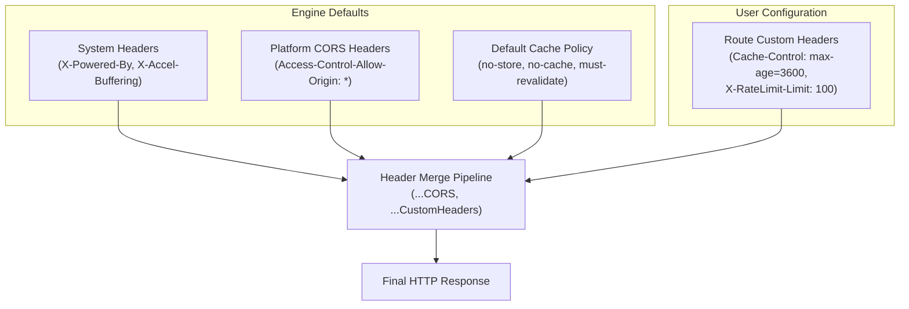

Modern web applications frequently inspect response headers for metadata such as rate-limit quotas, cache lifetimes, pagination links, and server timing metrics.

**Custom Response Headers** in Fack API give you full control over the headers returned by any mock endpoint. You can declare arbitrary HTTP headers on a per-route basis, enabling your frontend to test rate-limiting warnings, token expiration handlers, and caching policies before backend services are finalized.

## Common Use Cases

- **Rate Limit Indicators**: Deliver headers like `X-RateLimit-Limit` and `X-RateLimit-Remaining` to test countdown banners and client-side throttling.
- **Cache Directives**: Override default no-cache policies with `Cache-Control: max-age=3600` or `ETag` to verify browser and CDN caching.
- **Authentication & Tokens**: Return mock bearer tokens or refresh tokens in `Authorization` or `X-Token` headers.
- **Custom Content-Types**: Return `application/problem+json` or `application/xml` headers for specialized parsers.
- **CORS Customization**: Restrict `Access-Control-Allow-Origin` to specific domains for staging environments.

## The Headers Editor

In the **Edit Bar**, select the **Custom Response Headers** panel for your route node:

1. **Add Header**: Click **Add Header** to insert a new key-value row.
2. **Key & Value Inputs**: Enter the header name (e.g., `X-RateLimit-Remaining`) and its corresponding value (e.g., `42`).
3. **Delete**: Click the trash icon to remove any header row.
4. **Instant Update**: Changes apply immediately to subsequent requests without rebuilding or restarting.

## Quick Header Presets

The Headers Editor includes convenient one-click presets for common HTTP headers:

| Preset Header | Example Value | Description |
| :--- | :--- | :--- |
| `Content-Type` | `application/json` | Explicitly declares the MIME type of the response payload. |
| `Cache-Control` | `max-age=3600` | Instructs browsers or proxies to cache the payload for 1 hour. |
| `Access-Control-Allow-Origin` | `*` | Customizes cross-origin resource sharing policy. |
| `Authorization` | `Bearer token123` | Emulates mock access tokens returned in response headers. |
| `X-RateLimit-Limit` | `100` | Specifies the maximum number of requests allowed per window. |

## Header Merging & Precedence

Fack API automatically supplies default system and CORS headers to ensure mock endpoints work seamlessly from browsers and local test runners.

When custom headers are specified on a route, they are merged with the engine defaults, with **custom values taking precedence**:



For instance, if your route defines `Cache-Control: max-age=3600`, it replaces Fack API's default `no-cache` directive.

## Inspecting Headers with cURL

You can inspect the full HTTP transaction and headers using `curl -v` (verbose mode):

```bash title="Terminal"
curl -v http://localhost:3000/api/mock/acme/v1/orders
```

Verbose output displaying the merged response headers:

```http title="HTTP Response"
< HTTP/1.1 200 OK
< Content-Type: application/json
< X-Powered-By: Fack API's
< X-Accel-Buffering: no
< Access-Control-Allow-Origin: *
< Access-Control-Allow-Methods: GET, POST, PUT, DELETE, PATCH, OPTIONS
< Cache-Control: max-age=3600
< X-RateLimit-Limit: 100
< X-RateLimit-Remaining: 14
< Date: Tue, 22 Sep 2026 01:14:20 GMT
< Connection: keep-alive
```

## Reading Headers in Frontend Code

Frontend HTTP clients can easily parse these custom headers to enforce client-side constraints:

```ts title="src/api/client.ts"
export async function getOrders() {
  const response = await fetch("http://localhost:3000/api/mock/acme/v1/orders");

  // Read rate limit headers
  const rateLimitTotal = response.headers.get("X-RateLimit-Limit");
  const rateLimitRemaining = response.headers.get("X-RateLimit-Remaining");

  if (rateLimitRemaining && parseInt(rateLimitRemaining, 10) < 5) {
    console.warn(`Approaching rate limit: ${rateLimitRemaining}/${rateLimitTotal} remaining.`);
  }

  return response.json();
}
```

<Callout type="info">
  In accordance with HTTP specifications, HTTP/2 and modern fetch implementations normalize header names to lowercase (e.g., `x-ratelimit-remaining`).
</Callout>

## Configuration Reference

<TypeTable
  type={{
    key: {
      description: "HTTP header name (case-insensitive in standard HTTP, e.g. 'Cache-Control', 'X-RateLimit-Limit').",
      type: "string",
    },
    value: {
      description: "Value assigned to the header (e.g. 'max-age=3600', 'Bearer mock-jwt-token').",
      type: "string",
    },
  }}
/>
