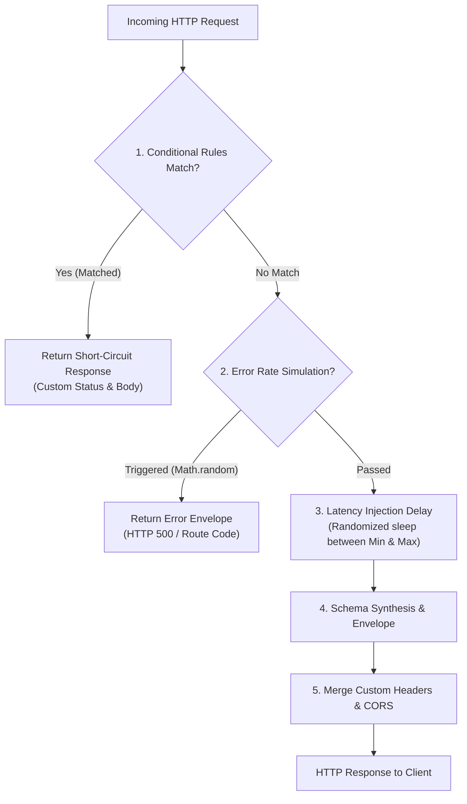

Building modern web and mobile frontends against "happy-path" APIs creates a false sense of security. In production, networks drop packets, cloud services suffer intermittent outages, cold-starts delay responses, and rate limits trigger unexpected errors.

**Chaos Engineering** in Fack API enables you to deliberately inject failure modes, jitter, and edge cases directly into your mock endpoints. By simulating unpredictable network conditions during development, your team can stress-test resilience patterns long before deploying to production.

## Why Frontend Chaos Testing Matters

Developing against zero-latency, always-online local servers hides fundamental UI vulnerabilities. Introducing controlled chaos helps you validate critical client-side mechanisms:

- **Error Boundaries**: Verify that component crashes are caught by React `<ErrorBoundary>` fallbacks rather than blanking out the entire page.
- **Loading & Skeleton States**: Ensure loading spinners, shimmer skeletons, and disabled button states render smoothly without layout shifts.
- **Retry Logic & Backoff**: Test whether clients like TanStack Query, RTK Query, or SWR correctly execute exponential backoff and jitter algorithms.
- **Timeout & Cancellation**: Validate that `AbortController` signals properly abort hanging queries and clean up active event listeners.
- **Optimistic UI Rollbacks**: Confirm that optimistic mutations revert local state cleanly when server mutations fail with 4xx or 5xx codes.

## The Chaos Pipeline

Every mock request passing through Fack API's mock handler evaluates chaos configurations in a defined sequence before schema synthesis:



## The Four Chaos Tools

Fack API provides four specialized chaos primitives configured per-route:

1. **[Latency Injection](/docs/chaos/latency)**: Introduce artificial asynchronous delays between `0ms` and `30,000ms` with min/max randomized jitter to emulate mobile networks and overloaded servers.
2. **[Error Rate Simulation](/docs/chaos/error-rates)**: Configure probabilistic failure percentages (`0%` to `100%`) returning standardized error envelopes to exercise error boundaries and retry logic.
3. **[Conditional Rules](/docs/chaos/rules)**: Define deterministic logic matching specific query parameters, request headers, or path variables to return tailored responses (such as 401 Unauthorized or 404 Not Found).
4. **[Custom Headers](/docs/chaos/headers)**: Inject arbitrary HTTP response headers such as `X-RateLimit-*`, `Cache-Control`, or custom tokens that merge directly with edge CORS headers.

## Configuration in the Edit Bar

All chaos settings are configured visually on a per-route basis in the **Edit Bar**:

1. Select any route node on the [Visual Canvas](/docs/canvas).
2. The right-hand Edit Bar opens displaying the route configuration panels.
3. Use the **Chaos Config** panel to adjust latency sliders and error rates, the **Rules Editor** for conditional matching, and the **Headers Editor** for custom response headers.
4. Changes save instantly and take effect on the very next HTTP request without server restarts.

<Callout type="info">
  Chaos settings are fully decoupled per route. You can simulate a failing billing route (`POST /checkout`) while keeping catalog queries (`GET /products`) fast and error-free.
</Callout>

## Composing Chaos Behaviors

Chaos tools are designed to compose together seamlessly. A single mock route can evaluate all chaos settings simultaneously:

```bash title="Example Composed Route Scenario"
# 1. Inspect request: Missing "Authorization: Bearer <token>" header?
#    --> Immediately return 401 Unauthorized via Conditional Rules.
# 2. Authorization present: Roll dice for a 15% random failure rate.
#    --> Return 500 Internal Server Error via Error Rate Simulation.
# 3. Request succeeds: Apply 800ms - 1,800ms artificial network delay.
#    --> Simulate mobile connection via Latency Injection.
# 4. Attach response headers: "X-RateLimit-Remaining: 2" and "Cache-Control".
#    --> Deliver mock payload with Custom Response Headers.
```

When composed, the mock engine guarantees that deterministic short-circuits (conditional rules) execute first, saving unnecessary schema computation and network delay.

## Explore the Chaos Tools

Dive into each chaos capability to configure failure modes for your API endpoints:

<Cards>
  <Card
    title="Latency Injection"
    href="/docs/chaos/latency"
    description="Simulate network jitter and slow mobile connections with min/max artificial delays."
  />
  <Card
    title="Error Rate Simulation"
    href="/docs/chaos/error-rates"
    description="Inject probabilistic HTTP failures to test error boundaries, toasts, and retry policies."
  />
  <Card
    title="Conditional Rules"
    href="/docs/chaos/rules"
    description="Route requests dynamically based on query params, headers, and path variables."
  />
  <Card
    title="Custom Response Headers"
    href="/docs/chaos/headers"
    description="Inject rate-limiting indicators, cache controls, and authorization headers."
  />
</Cards>
