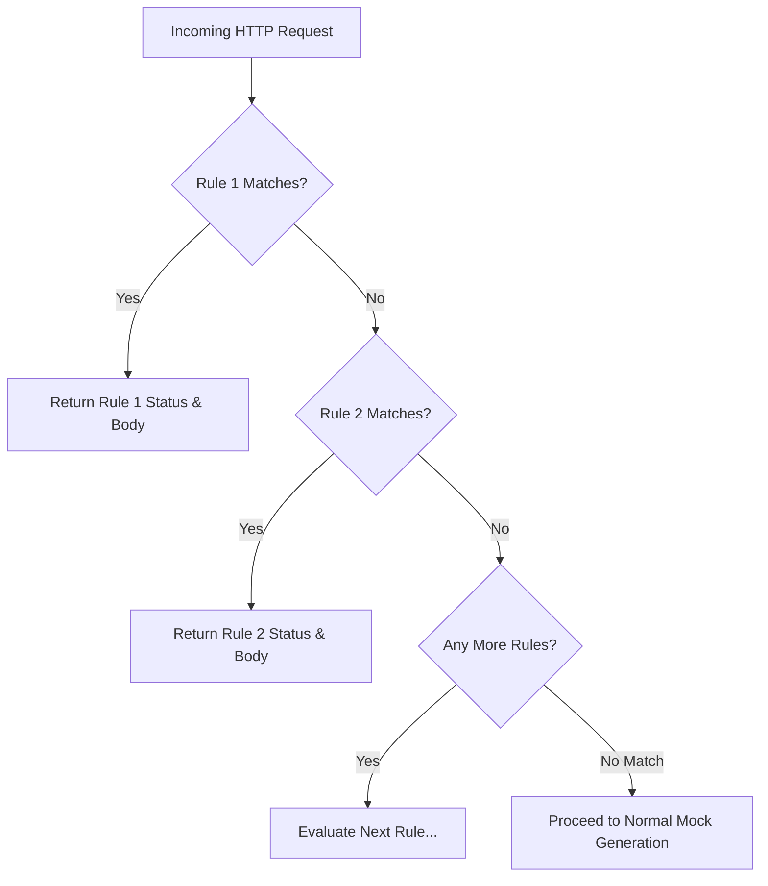

While random errors test general resilience, frontend developers also need **deterministic, context-aware responses** to test specific application branches. For example, testing how a login screen responds to invalid credentials, how a product page displays a missing record, or how a checkout flow handles an expired token.

**Conditional Rules** evaluate incoming requests against custom inspection rules before data synthesis. When a rule matches, the mock engine immediately short-circuits the pipeline and returns the specified HTTP status code and response payload.

## How Rules Evaluation Works

Conditional rules are evaluated in the order they appear in the route configuration. The first rule whose condition evaluates to `true` terminates processing and produces the response:



## Creating a Conditional Rule

Follow these steps to configure conditional routing for any endpoint:

<Steps>
  <Step>
    ### 1. Open the Rules Editor
    Select a route node on the [Canvas](/docs/canvas) and scroll down to the **Conditional Rules** section in the right-hand Edit Bar.
  </Step>

  <Step>
    ### 2. Click "Add Rule"
    Click **Add Rule** to create a new blank condition, or click one of the quick preset buttons to start with a pre-configured template.
  </Step>

  <Step>
    ### 3. Select an Inspection Target
    Choose the source component of the incoming HTTP request to inspect:
    - `query`: A URL query parameter (e.g. `?error=true`, `?status=inactive`).
    - `header`: An incoming HTTP request header (e.g. `Authorization`, `X-Client-Version`).
    - `param`: A dynamic path variable extracted from the route path (e.g. `:id` from `/users/:id`).
  </Step>

  <Step>
    ### 4. Enter the Key to Inspect
    Enter the parameter or header key (case-insensitive for headers). Examples: `Authorization`, `id`, `error`, `role`.
  </Step>

  <Step>
    ### 5. Choose an Operator
    Select the comparison operator to apply against the incoming value:
    - `equals`: Exact string equality match.
    - `contains`: Substring match within the extracted value.
    - `exists`: Evaluates whether the header or parameter is present in the request.
  </Step>

  <Step>
    ### 6. Enter the Expected Value
    For `equals` or `contains`, provide the target string to match against (e.g., `not-found`, `admin`, `true`). For `exists`, the value field is not required.
  </Step>

  <Step>
    ### 7. Set the Response Status Code
    Specify the HTTP status code to return when the rule matches (e.g., `401 Unauthorized`, `403 Forbidden`, `404 Not Found`, `500 Internal Server Error`).
  </Step>

  <Step>
    ### 8. Define the Response Body
    Provide an optional JSON or plain text body returned to the client. If left blank, the response will return an empty body with the chosen status code.
  </Step>
</Steps>

## Built-In Presets & Examples

Fack API provides three standard rule presets accessible directly inside the Rules Editor:

<Tabs items={["401 Missing Auth", "404 Not Found", "500 Error Trigger"]}>
  <Tab value="401 Missing Auth">
    Simulate authentication guards by requiring clients to send an `Authorization` header.

    - **Target**: `header`
    - **Key**: `Authorization`
    - **Operator**: `exists` *(rule triggers if missing or invalid)*
    - **Status**: `401 Unauthorized`

    ```bash title="Test Request (Fails with 401)"
    curl -i http://localhost:3000/api/mock/acme/v1/profile
    ```

    ```json title="HTTP 401 Response"
    {
      "error": "Unauthorized",
      "message": "Missing authorization header"
    }
    ```
  </Tab>

  <Tab value="404 Not Found">
    Simulate missing database records when a dynamic path parameter matches a sentinel ID like `not-found` or `999`.

    - **Target**: `param`
    - **Key**: `id`
    - **Operator**: `equals`
    - **Value**: `not-found`
    - **Status**: `404 Not Found`

    ```bash title="Test Request (Path Param Trigger)"
    curl -i http://localhost:3000/api/mock/acme/v1/users/not-found
    ```

    ```json title="HTTP 404 Response"
    {
      "error": "Not Found",
      "message": "Record not-found does not exist"
    }
    ```
  </Tab>

  <Tab value="500 Error Trigger">
    Trigger an immediate server-side exception on demand by passing a query parameter flag without affecting normal requests.

    - **Target**: `query`
    - **Key**: `error`
    - **Operator**: `equals`
    - **Value**: `true`
    - **Status**: `500 Internal Server Error`

    ```bash title="Test Request (Query Trigger)"
    curl -i "http://localhost:3000/api/mock/acme/v1/orders?error=true"
    ```

    ```json title="HTTP 500 Response"
    {
      "error": "Internal Server Error",
      "message": "Simulated server failure"
    }
    ```
  </Tab>
</Tabs>

## Rule Configuration Reference

<TypeTable
  type={{
    type: {
      description: "Request segment to inspect: 'query' (URL query string), 'header' (request headers), or 'param' (path parameter).",
      type: "'query' | 'header' | 'param'",
    },
    key: {
      description: "Name of the header, query parameter, or dynamic path token to extract.",
      type: "string",
    },
    operator: {
      description: "Matching logic: 'equals' (strict equality), 'contains' (substring search), or 'exists' (presence check).",
      type: "'equals' | 'contains' | 'exists'",
    },
    value: {
      description: "Target value compared against incoming request string (required for equals/contains).",
      type: "string",
    },
    responseStatus: {
      description: "HTTP status code emitted when rule condition matches (e.g. 401, 403, 404, 500).",
      type: "number",
      default: "200",
    },
    responseBody: {
      description: "Stringified JSON or text returned as the response payload when rule triggers.",
      type: "string",
    },
  }}
/>
