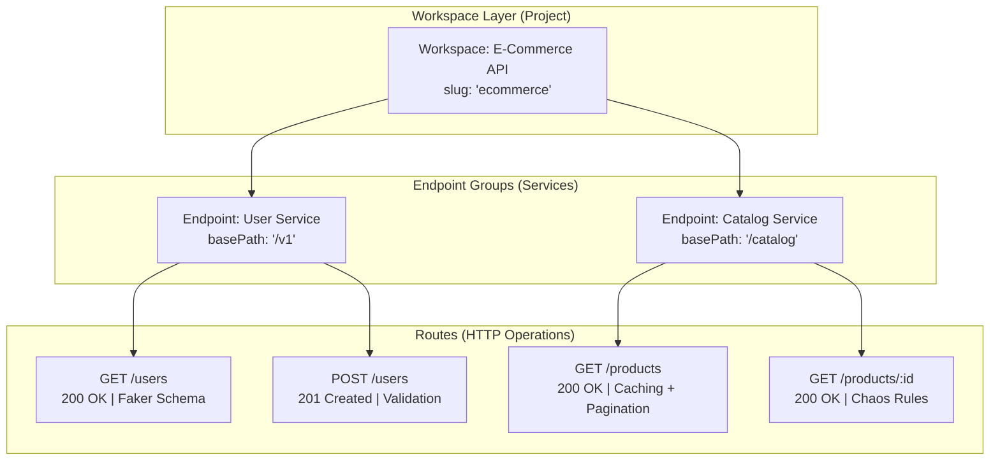

Fack API is designed around an intuitive, hierarchical resource model that maps cleanly to modern RESTful backend architectures and microservices.

Understanding these core concepts will help you structure realistic mock environments, manage complex dependency graphs, and test frontend applications with confidence.

## The Data Hierarchy

Every resource in Fack API lives within a three-tier hierarchy: **Workspaces**, **Endpoints**, and **Routes**.

### 1. Workspaces (Projects)

A **Workspace** (represented internally as a Project) is the top-level boundary for an API system or microservice suite.

- **Unique Slug**: Every workspace is assigned a globally unique URL slug (e.g., `ecommerce`, `billing-api`). All incoming mock requests must include this slug in the path (`http://localhost:3000/<slug>/...`) or as a subdomain (`http://<slug>.localhost:3000/...`).
- **Canvas State**: Persists the spatial node coordinates, edges, zoom level, and viewport offsets of the visual diagram.
- **Global Toggles**: Enable or disable request logging and in-memory LRU caching across the entire workspace.

### 2. Endpoints (Service Groups)

An **Endpoint** represents a logical grouping of related routes, functioning like a microservice or domain controller (e.g., `Auth Service`, `Cart Service`, or `v1 Core`).

- **Shared Base Path**: Every endpoint defines a `basePath` (such as `/v1`, `/api/auth`, or `/store`).
- **Visual Grouping**: On the visual canvas, endpoints serve as parent containers or connection hubs that anchor their child routes.
- **Path Concatenation**: Child route paths are automatically prefixed with the endpoint's `basePath`.

### 3. Routes (HTTP Handlers)

A **Route** is the executable unit of the mock server. It maps directly to an HTTP operation:

- **HTTP Method**: Supports standard REST methods: `GET`, `POST`, `PUT`, `DELETE`, and `PATCH`.
- **Path Pattern**: Supports static paths (`/users`) and parameterized expressions (`/users/:id`, `/orders/:orderId/items`).
- **Status Code**: Defaults to `200`, but can be customized to any standard HTTP status (`201`, `204`, `400`, `404`, `500`).
- **Response Schema**: JSON Schema definition annotated with Faker.js providers to synthesize realistic mock responses.
- **Chaos Configuration**: Rule-based error rate simulation (`errorRate`), simulated network delay (`latencyMin` and `latencyMax`), custom HTTP response headers, and conditional overrides.
- **Enable/Disable**: Routes can be toggled on or off instantly without deleting their configuration.

## Dual Interfaces: Canvas & Dashboard

Fack API provides two synchronized views into the same underlying architecture. Changes made in one view immediately reflect in the other.

<Tabs items={["Visual Canvas", "Dashboard View"]}>

<Tab value="Visual Canvas">
The **Visual Canvas** is an interactive, node-based workspace powered by React Flow (`@xyflow/react`).

- **Spatial Architecture**: Graphically arrange endpoints and routes as connected nodes to visualize service boundaries.
- **Interactive Wiring**: Connect routes to endpoints with draggable bezier handles.
- **Interactive Controls**: Zoom, pan, search, mini-map navigation, and quick layout alignment.
- **Integrated Edit Bar**: Select any node to view real-time schema previews, Faker.js provider pickers, and chaos sliders without leaving the canvas.
</Tab>

<Tab value="Dashboard View">
The **Dashboard View** offers a structured, list-based perspective optimized for rapid scanning and bulk management.

- **Tabular Navigation**: Filter and search through large route collections across multiple endpoints.
- **Quick Actions**: Rapidly toggle route statuses, duplicate mock handlers, and adjust latency settings.
- **Metrics & Telemetry**: Inspect incoming request logs, latency percentiles, and cache hit rates.
- **Team-Friendly**: Ideal for developers who prefer conventional list-based API management tools.
</Tab>

</Tabs>

## How Requests Are Resolved

When a client sends an HTTP request to Fack API:

1. **Proxy Interception**: The edge proxy (`proxy.ts`) inspects the host header and URL path to resolve the target workspace slug.
2. **Radix Tree Matching**: The mock engine matches the request method and combined path (`basePath + routePath`) using a high-performance radix tree router (`radix3`).
3. **Chaos Evaluation**: If chaos rules or simulated error rates are configured, the engine evaluates whether to inject delay or return a simulated failure.
4. **Faker Synthesis**: The JSON Schema is evaluated through `json-schema-faker` and `@faker-js/faker` to generate fresh or cached mock data.
5. **Response Envelope**: The generated data is packaged into a standard `{ data, meta }` response envelope and dispatched with custom headers.

## Explore Next

Deepen your understanding of Fack API's core subsystem features:

<Cards>
  <Card title="Visual Canvas" href="/docs/canvas" description="Learn node interactions, wiring patterns, and canvas layouts." />
  <Card title="Schema Builder" href="/docs/schemas" description="Design dynamic schemas with 1,500+ Faker.js providers." />
  <Card title="Mock Engine" href="/docs/mock-engine" description="Discover radix tree routing, query filtering, and caching." />
  <Card title="Chaos Engineering" href="/docs/chaos" description="Test frontend resilience with latency injection and error rates." />
</Cards>
