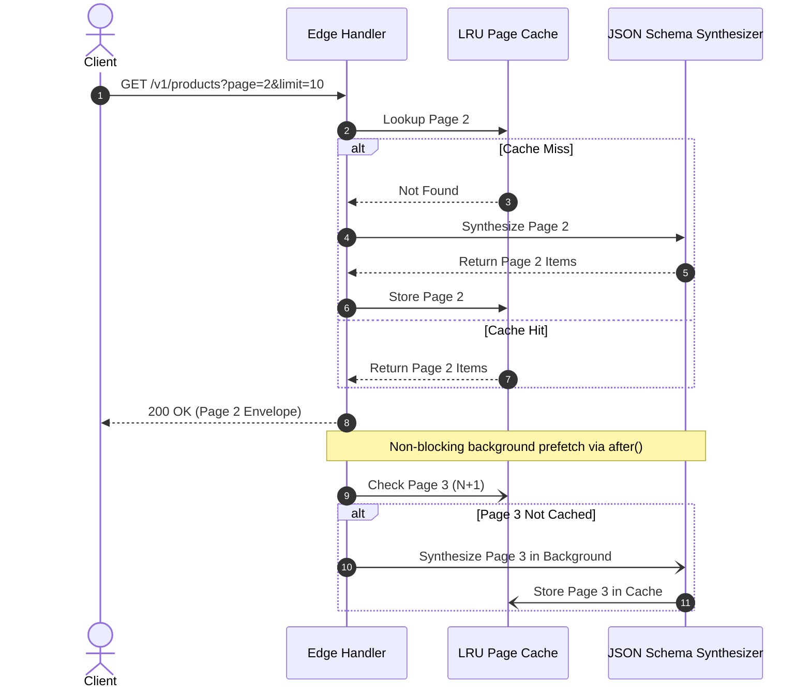

Generating rich mock payloads with hundreds of Faker.js providers and complex JSON Schema validations can add noticeable processing overhead. To deliver consistent **single-digit millisecond response times**, Fack API features an object-oriented, bounded in-memory caching architecture backed by `lru-cache` and `unstorage`.

By storing compiled route lists, synthesized entity objects, and paginated slices in memory, subsequent requests bypass schema compilation and database lookups entirely.

## Multi-Tier Cache Architecture

The `CacheManager` singleton partitions cache storage across six discrete domains. Each tier enforces strict maximum entry limits and time-to-live (TTL) expiration to prevent unbounded memory growth:

<TypeTable
  type={{
    "Project List": {
      description: "Stores metadata for all active projects. Max: 50 entries, TTL: 10 minutes.",
      type: "LRUCache<string, Project[]>",
    },
    "Project by Slug": {
      description: "Maps project slugs to project records. Max: 500 entries, TTL: 10 minutes.",
      type: "LRUCache<string, Project>",
    },
    "Project Routes": {
      description: "Stores compiled route definitions per project. Max: 1,000 entries, TTL: 5 minutes.",
      type: "LRUCache<string, Route[]>",
    },
    "Mock Data (Array)": {
      description: "Cached array collection payloads for list routes. Max: 2,000 entries, TTL: 5 minutes.",
      type: "LRUCache<string, unknown[]>",
    },
    "Single Object": {
      description: "Cached single entity payloads for scalar routes. Max: 2,000 entries, TTL: 5 minutes.",
      type: "LRUCache<string, object>",
    },
    "Page Cache": {
      description: "Paginated window slices partitioned by page and limit. Max: 2,000 entries, TTL: 5 minutes.",
      type: "LRUCache<string, PageCacheEntry[]>",
    },
  }}
/>

---

## Predictive Page N+1 Prefetching

For paginated collections (`?page=2&limit=10`), the mock engine implements proactive background prefetching using Next.js `after()`.

### Sliding Window Pruning

To keep memory consumption bounded as users browse through deep pagination catalogs, the engine enforces **sliding window pruning**.

When page $N$ is requested, the page cache retains only the immediate neighbourhood:
- Page $N - 1$ (Previous)
- Page $N$ (Current)
- Page $N + 1$ (Next)

Distant pages beyond this $\pm 1$ window are pruned, ensuring that browsing forward through 50 pages of records does not accumulate redundant memory.

---

## Granular Cache Invalidation

Unlike naive caching systems that wipe all application state on every mutation, Fack API provides granular invalidation routines:

- `clearRouteCache(routeId)`: Invalidates the mock data array, single object cache, and page cache entries associated with a specific route.
- `clearProjectCache(projectId, projectSlug)`: Evicts the project route tree, project metadata, and slug mappings.
- `clearCache()`: Flushes all internal LRU stores across all project domains.

<Callout type="warn">
  Modifying a route's JSON Schema or changing its chaos settings automatically invokes `clearRouteCache(routeId)`. If you test an endpoint immediately after updating its schema, the first request will generate fresh mock data.
</Callout>

---

## Project-Level Cache Toggle

Caching can be toggled on or off on a per-project basis using the `isCachingEnabled` attribute in project settings. When disabled:

1. Every incoming request invokes the JSON Schema Faker synthesizer.
2. Newly randomized values are produced on every page refresh.
3. Network latency measurements reflect cold generation times.
