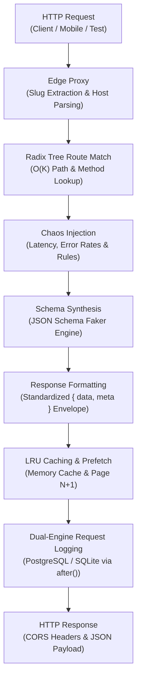

The **Fack API Mock Engine** is an edge-native, real-time mock service that resolves incoming HTTP requests, synthesizes realistic JSON data on the fly, applies chaos testing scenarios, and serves responses in single-digit milliseconds.

All processing occurs strictly **server-side** inside the Next.js edge proxy and API runtime. Clients communicate with your mock endpoints just like they would with a real production backend, without needing browser extensions, local service workers, or client-side interception libraries.

## Request Execution Flow

Every request dispatched to a Fack API endpoint passes through an 8-stage processing pipeline. The architecture guarantees high throughput, deterministic routing, and realistic network simulation.

## Execution Pipeline Stages

<Steps>
  <Step>
    ### 1. Edge Proxy & Slug Resolution
    The Next.js edge proxy (`proxy.ts`) intercepts the incoming request before any page or route handler executes. It parses the hostname to identify subdomain-based slugs (e.g. `shop.localhost:3000`) or extracts the first path segment for path-based routing (e.g. `/shop/v1/users`). System paths like `/dashboard` and static assets pass through unchanged.
  </Step>

  <Step>
    ### 2. Radix Tree Route Matching
    The engine fetches the project's enabled routes and matches the concrete request path using an optimized Radix Tree router (`radix3`). Dynamic parameters like `/users/:userId` and catch-all wildcards like `/files/*path` are extracted in $O(K)$ lookup time, where $K$ is the path depth.
  </Step>

  <Step>
    ### 3. Conditional Rules & Chaos Evaluation
    Before generating data, the engine checks for user-defined conditional rules that override the standard response based on query parameters, request headers, or path variables. If chaos simulation is configured, artificial jitter latency is injected and probabilistic error rates (4xx/5xx) are evaluated.
  </Step>

  <Step>
    ### 4. Schema Synthesis & Faker Expansion
    For valid requests, the engine synthesizes mock datasets using the route's JSON Schema. The synthesizer evaluates over 1,500 Faker.js data generators (names, addresses, financial records, commerce items) and custom image URL providers (LoremFlickr, Picsum).
  </Step>

  <Step>
    ### 5. Response Envelope Formatting
    The raw synthesized data is passed through a SOLID-compliant formatter factory. Responses are wrapped in a standardized envelope containing the payload `data` and comprehensive runtime `meta` (route ID, project ID, timing, pagination state, and cache status).
  </Step>

  <Step>
    ### 6. Bounded In-Memory LRU Caching
    To minimize overhead and avoid re-evaluating schemas on identical requests, responses are stored across tiered in-memory LRU caches. For paginated queries, the engine automatically schedules prefetching of the next page in the background.
  </Step>

  <Step>
    ### 7. Non-Blocking Dual-Engine Logging
    Request metadata, status codes, query strings, headers, and response payloads are logged asynchronously via Next.js `after()`. Logs are written to PostgreSQL or local SQLite without adding latency to the client response.
  </Step>
</Steps>

<Callout type="info">
  The mock engine requires no external mock server processes. It runs seamlessly whether you host Fack API via Docker, Vercel, Node.js standalone, or standard serverless environments.
</Callout>

## Explore Mock Engine Features

Dive deeper into individual components of the mock engine to master its routing, query parsing, envelopes, and caching capabilities:

<Cards>
  <Card
    title="Response Envelope"
    href="/docs/mock-engine/response-format"
    description="Learn about the standardized { data, meta } envelope and single, list, and paginated formatters."
  />
  <Card
    title="Filtering, Search & Sort"
    href="/docs/mock-engine/query-params"
    description="Query parameter capabilities including exact field filtering, full-text search, sorting, and pagination."
  />
  <Card
    title="Subdomain & Path Routing"
    href="/docs/mock-engine/routing"
    description="Understand path-based versus subdomain-based routing, Radix tree matching, and wildcards."
  />
  <Card
    title="CORS & Proxy Headers"
    href="/docs/mock-engine/cors"
    description="Zero-configuration CORS handling, preflight OPTIONS 204 caching, and proxy optimization headers."
  />
  <Card
    title="LRU Cache & Prefetching"
    href="/docs/mock-engine/caching"
    description="In-memory cache tiers, background page N+1 prefetching, and granular cache invalidation."
  />
  <Card
    title="Chaos Engineering"
    href="/docs/chaos"
    description="Simulate real-world network instability with latency injection, error rates, and conditional rules."
  />
</Cards>
