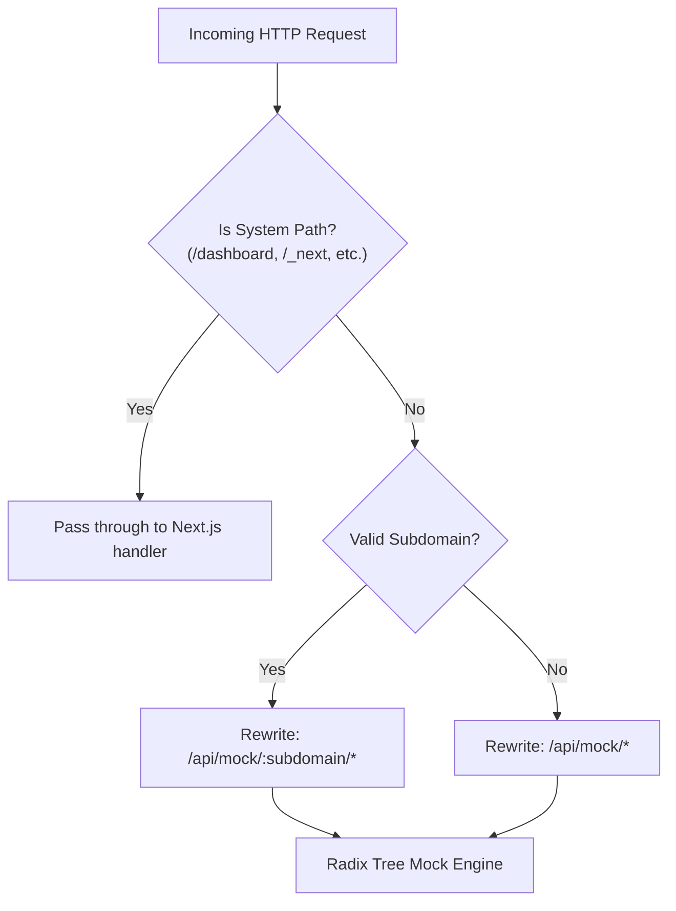

Fack API supports two flexible routing architectures to dispatch incoming HTTP requests to the appropriate project workspace: **Path-based routing** (the default zero-config mode) and **Subdomain-based routing** (production multi-tenant isolation).

Both modes are intercepted at the edge proxy level (`proxy.ts`) and transparently rewritten to the unified internal mock handler at `/api/mock/:projectSlug/*`.

## Routing Modes

<Tabs items={["Path-Based (Default)", "Subdomain-Based"]}>
  <Tab value="Path-Based (Default)">
    In **path-based routing**, the first segment of the URL pathname is extracted as the project slug:

    ```
    http://localhost:3000/:projectSlug/v1/users
    ```

    For example, querying `http://localhost:3000/acme-shop/v1/users` identifies `acme-shop` as the project slug and resolves `/v1/users` against the routes configured inside that project. This mode requires zero domain or DNS configuration.
  </Tab>

  <Tab value="Subdomain-Based">
    In **subdomain-based routing**, the project slug is parsed directly from the request `Host` header:

    ```
    http://:projectSlug.localhost:3000/v1/users
    ```

    For production deployments, setting the `APP_DOMAIN` environment variable (e.g. `APP_DOMAIN=fackapi.dev`) enables vanity hostnames such as `http://acme-shop.fackapi.dev/v1/users`.
  </Tab>
</Tabs>

---

## Edge Proxy Rewriting

When a request enters the platform, `proxy.ts` determines whether the request targets an internal dashboard resource, a static asset, or a mock API endpoint.



### Excluded System Subdomains

To prevent mock routes from intercepting platform administration features, the following subdomains are explicitly ignored by the subdomain extractor:

- `www`
- `api`
- `dashboard`
- `admin`

### Rewrite Mapping Examples

| Incoming Client URL | Routing Mode | Internal Next.js Rewrite Target |
| :--- | :--- | :--- |
| `http://localhost:3000/store/v1/items` | Path-Based | `/api/mock/store/v1/items` |
| `http://store.localhost:3000/v1/items` | Subdomain | `/api/mock/store/v1/items` |
| `http://acme.fackapi.dev/v2/auth/login` | Subdomain | `/api/mock/acme/v2/auth/login` |
| `http://localhost:3000/dashboard/projects` | System Path | `/dashboard/projects` (No rewrite) |

---

## Radix Tree O(K) Route Matching

Once the proxy routes the request to the project namespace, Fack API matches the request method and path against active route definitions using **Radix3**, a lightweight and high-throughput Radix tree router.

### Why Radix Trees?

Traditional regex-based routers test incoming paths sequentially ($O(N)$), causing latency to scale linearly as your project grows to hundreds of endpoints. In contrast, a Radix tree router traverses path segments hierarchically:

- **Lookup Complexity**: $O(K)$, where $K$ is the number of path segments in the URI.
- **Independence**: Lookup speed remains constant whether your project has 5 routes or 5,000 routes.

### Dynamic Path Parameters

Routes can define named parameter tokens prefixed with a colon (`:`):

```
/users/:userId/orders/:orderId
```

When a request arrives at `/users/usr_481/orders/ord_990`, the router automatically extracts the parameter dictionary:

```json
{
  "userId": "usr_481",
  "orderId": "ord_990"
}
```

Extracted parameters are decoded and made available to [Conditional Chaos Rules](/docs/chaos) and request logging.

### Catch-All Wildcards

To mock file storage, proxy catch-alls, or arbitrary nested paths, use an asterisk prefix (`*param`):

```
/files/*filepath
```

An incoming request to `/files/documents/2026/quarterly-report.pdf` yields:

```json
{
  "filepath": ["documents", "2026", "quarterly-report.pdf"]
}
```

<Callout type="info">
  The mock engine automatically normalizes paths by collapsing redundant slashes (e.g. `/v1//users/` becomes `/v1/users`) and enforcing strict trailing slash neutrality.
</Callout>
