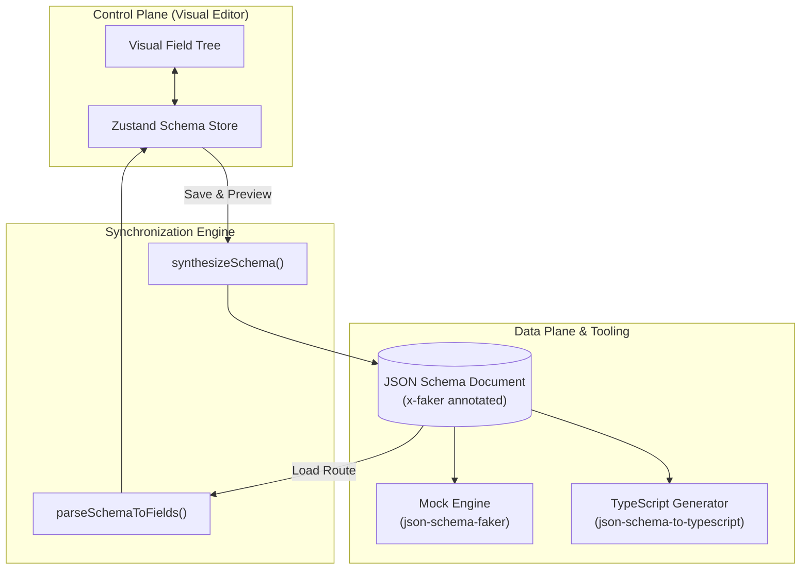

The **Schema Builder** is Fack API's visual data modeling environment. Located inside the route **Edit Bar** drawer, it allows you to construct complex, deeply nested JSON response payloads through an intuitive field tree interface without having to manually craft raw JSON Schema specifications.

Whether you are prototyping a quick mobile screen or mocking an enterprise microservice response, the Schema Builder provides granular control over data types, nullability, list structures, and realistic mock generation.

## Key Capabilities

The schema editor provides a complete visual toolset for defining endpoint contracts:

- **Visual Field Tree**: Add, remove, and reorder response properties with instant drag-and-drop or action buttons.
- **Type Assignment**: Select from standard primitive types (`string`, `number`, `integer`, `boolean`) or nested composite structures (`object`, `array`).
- **Nullability Control**: Toggle nullability per field to simulate optional or empty values in mock scenarios.
- **Faker.js Bindings**: Connect any field directly to over 1,500 contextual data providers across 25+ categories.
- **Bidirectional Sync**: Real-time conversion between the visual field tree and standard JSON Schema documents.

## Bidirectional Schema Architecture

At the heart of the Schema Builder is a two-way synchronization engine managed by a reactive Zustand store. Changes made in the visual editor immediately generate a standards-compliant JSON Schema document with `x-faker` vendor extensions, which is stored in the database and consumed by the mock runtime engine.

### Core Synchronization Functions

The synchronization layer relies on two deterministic helper functions:

1. **`synthesizeSchema(fields: SchemaField[])`**:
   Traverses the visual hierarchy and recursively compiles field nodes into an official JSON Schema document. It maps nullability to union types (e.g., `["string", "null"]`), registers non-nullable fields in the schema's `required` array, and embeds selected Faker methods into `x-faker` properties.

2. **`parseSchemaToFields(schema: JsonSchema)`**:
   Performs the reverse operation when you select a route on the canvas. It reads the persisted `responseSchema` string from the database, inspects types, child properties, and `x-faker` attributes, and reconstructs the interactive visual field tree.

<Callout type="info">
Because the schema is stored as standard JSON Schema, you retain full interoperability with OpenAPI 3.x specifications, JSON Schema validators, and external code generation pipelines.
</Callout>

## Editing Workflow

To customize the mock response schema for any endpoint:

1. Click any route node on the [Visual Canvas](/docs/canvas) or select a route in the sidebar to open the **Edit Bar** drawer.
2. Under the **Response Schema** section, inspect the current field tree.
3. Click **Add Field** to insert new properties at the root or inside nested objects.
4. Set the field name, select the data type, toggle nullable if needed, and assign an optional Faker provider.
5. Save your changes to update the live mock engine route immediately.

## Explore the Documentation

Dive deeper into data modeling, provider integration, and automated type generation:

<Cards>
  <Card
    title="Field Types & Nesting"
    href="/docs/schemas/field-types"
    description="Explore primitive data types, deep object nesting, and typed array collections."
  />
  <Card
    title="Faker Data Providers"
    href="/docs/schemas/faker-providers"
    description="Discover over 1,500 Faker.js providers for generating realistic production-grade mock data."
  />
  <Card
    title="TypeScript Export"
    href="/docs/schemas/typescript"
    description="Export synchronized TypeScript interfaces and download declaration files for your frontend."
  />
</Cards>
