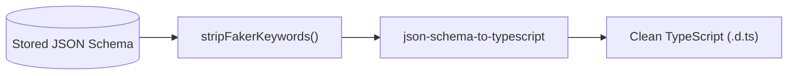

Keeping frontend client interfaces in sync with evolving backend endpoints is a major source of development friction. In Fack API, your visual schema models serve as the single source of truth for both mock data generation and client-side **TypeScript types**.

## Overview & Capabilities

Every route configured in the Schema Builder can be exported as a strongly-typed TypeScript interface with:

- **In-Dashboard Preview**: View syntax-highlighted TypeScript definitions in a modal dialog without leaving the canvas.
- **One-Click Copy**: Copy generated type definitions directly to your clipboard for quick pasting into frontend codebases.
- **Direct `.d.ts` Download**: Download a self-contained declaration file (`<TypeName>.d.ts`) ready to drop into your project's `types/` folder.
- **REST API Endpoint**: Programmatically fetch generated types at `GET /api/typescript/:routeId` for automated code generation scripts and CI pipelines.

## How to Export TypeScript Types

<Steps>
  <Step>
    ### Open the Route Edit Bar
    Click on any route node in the visual canvas or select it from the sidebar route list to open the Edit Bar drawer.
  </Step>

  <Step>
    ### Click TypeScript Preview
    In the top toolbar of the Edit Bar, click the **TypeScript Preview** button (code icon).
  </Step>

  <Step>
    ### Review the Generated Interface
    Inspect the compiled TypeScript definition in the dialog viewer. Verify field types, optional flags, and nested interfaces.
  </Step>

  <Step>
    ### Copy or Download
    Click **Copy Code** to copy the snippet to your clipboard, or click **Download .d.ts** to save the type definition file locally.
  </Step>
</Steps>

## Naming Conventions

Interface names are automatically generated in **PascalCase** from the route's HTTP method and path hierarchy:

- Dynamic URL parameters (such as `:id` or `:slug`) are omitted to keep interface names clean and idiomatic.
- Segment names are capitalized and concatenated.
- All interface names are suffixed with `Response`.

| HTTP Method | Route Path | Generated Interface Name |
| :--- | :--- | :--- |
| `GET` | `/v1/customers/:id` | `GetV1CustomersResponse` |
| `POST` | `/api/auth/login` | `PostApiAuthLoginResponse` |
| `PUT` | `/projects/:id/members` | `PutProjectsMembersResponse` |
| `GET` | `/` | `GetRootResponse` |

## Schema to TypeScript Example

Here is how visual schema fields translate into an exported TypeScript declaration:

<Tabs items={["Visual Schema / JSON", "Generated TypeScript"]}>
  <Tab value="Visual Schema / JSON">
```json title="response-schema.json"
{
  "type": "object",
  "properties": {
    "id": { "type": "string", "format": "uuid", "x-faker": "string.uuid" },
    "name": { "type": "string", "x-faker": "person.fullName" },
    "email": { "type": ["string", "null"], "x-faker": "internet.email" },
    "role": { "type": "string" },
    "metadata": {
      "type": "object",
      "properties": {
        "loginCount": { "type": "integer" },
        "lastActive": { "type": "string" }
      },
      "required": ["loginCount"]
    },
    "tags": {
      "type": "array",
      "items": { "type": "string" }
    }
  },
  "required": ["id", "name", "role", "tags"]
}
```
  </Tab>

  <Tab value="Generated TypeScript">
```ts title="GetV1CustomersResponse.d.ts"
/**
 * Auto-generated by Fack API's
 * Do not edit manually — regenerate from the dashboard.
 */

export interface GetV1CustomersResponse {
  id: string;
  name: string;
  email?: string | null;
  role: string;
  metadata?: {
    loginCount: number;
    lastActive?: string;
  };
  tags: string[];
}
```
  </Tab>
</Tabs>

## Internal Compilation Pipeline

Before generating TypeScript source code, Fack API processes the schema through the following pipeline:



1. **Vendor Extension Stripping**:
   Internal keywords such as `x-faker` and mock-specific format overrides are sanitized by `stripFakerKeywords()`. This ensures 100% compliance with standard JSON Schema specifications.

2. **Nullability Resolution**:
   Nullable fields represented as union types (`["string", "null"]`) are converted into TypeScript union types (`string | null`). Properties not listed in `required` are decorated with the TypeScript optional flag (`?:`).

3. **Code Formatting**:
   The output is compiled using `json-schema-to-typescript` with formatted indentation and prepended with an auto-generation banner header.

<Callout type="info">
You can integrate type generation into your frontend build scripts or OpenAPI toolchains using the endpoint `GET /api/typescript/:routeId`. The endpoint returns the source code with standard `Content-Disposition: attachment` headers.
</Callout>
